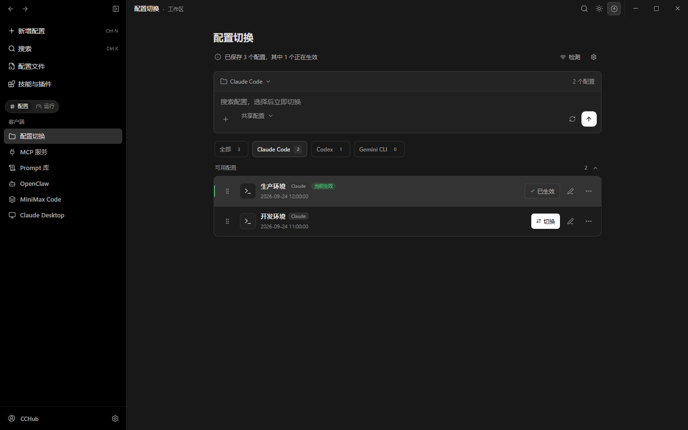

<div align="center">


# CCHub

### Stop editing JSON files. Manage your Claude Code ecosystem from one app.

[](https://github.com/Moresl/cchub/stargazers)
[](https://github.com/Moresl/cchub/releases)
[](https://github.com/Moresl/cchub/releases)
[](LICENSE)
[](https://tauri.app)

**Windows** · **macOS** · **Linux** &nbsp;|&nbsp; [中文](README.zh-CN.md) · English

[**Download**](https://github.com/Moresl/cchub/releases/latest) &nbsp;&nbsp;·&nbsp;&nbsp; [Report Bug](https://github.com/Moresl/cchub/issues) &nbsp;&nbsp;·&nbsp;&nbsp; [Request Feature](https://github.com/Moresl/cchub/issues)

</div>

---

## The Problem

The Claude Code ecosystem is exploding — MCP Servers, Skills, Plugins, Hooks, Workflows — but management is stuck in the stone age:

- Editing `settings.json` by hand, hoping you don't break the syntax
- Copy-pasting MCP configs between machines
- No idea which of your 30 MCP servers are actually working
- Switching between Claude / Codex / Gemini configs = nightmare
- Zero visibility into security risks from your installed tools

**CCHub puts everything in one GUI.** Install MCP servers in one click. Switch configs instantly. Monitor health. Audit security. Done.

---

## Screenshots

> **Note:** Add your screenshots to the `screenshots/` directory and they will display here.

<!-- Replace these placeholders with actual screenshots -->

| Dashboard | MCP Servers | Config Profiles |
|:-:|:-:|:-:|
|  |  |  |

| MCP Marketplace | Tools & Plugins | Dark Theme |
|:-:|:-:|:-:|
|  |  |  |

---

## Features

### Core Management

| Feature | Description |
|---------|-------------|
| **MCP Server Management** | Auto-scan Claude Code, Claude Desktop, Cursor configs. Enable/disable, edit, delete — no JSON editing |
| **MCP Marketplace** | Built-in registry with categories. One-click install with env config. Custom source support |
| **MCP Health Monitor** | Command check, process spawn test, latency measurement. Know which servers are broken |
| **Config Profiles** | One-click switch between Claude Code, Codex, Gemini CLI, OpenCode, OpenClaw configs |
| **Skills & Plugins** | Browse, edit (MDXEditor rich-text), cross-tool sync |
| **Workflows** | 12 built-in templates (Code Review, TDD, Bug Diagnosis, Security Audit...). One-click install |
| **Hooks Visualizer** | See all hooks: event types, matchers, commands — at a glance |

### Developer Experience

| Feature | Description |
|---------|-------------|
| **CLAUDE.md Manager** | Visual editor for project instructions with templates |
| **Autopilot** | Task orchestration for Claude / Codex auto-execution with real-time monitoring |
| **Command Palette** | `Ctrl+K` to navigate anywhere instantly |
| **Security Audit** | Env secrets, shell execution risks, npx auto-install risk scanning |
| **StatusLine (claude-hud)** | One-click install, proxy support, China mirror, display config |

### Platform

| Feature | Description |
|---------|-------------|
| **Cross-platform** | Windows 10/11, macOS 10.15+, Linux |
| **Dark / Light Theme** | Glassmorphism UI with system-aware theme |
| **Backup & Restore** | Export all configs as SQL, import with legacy format support |
| **Auto Update** | Built-in updater with GitHub Releases fallback |
| **i18n** | Chinese, English, Japanese |
| **System Tray** | Minimize to tray on close |

---

## Quick Comparison

| Task | Without CCHub | With CCHub |
|------|:---:|:---:|
| Install an MCP server | Edit JSON, find npm package, configure env vars manually | One click from Marketplace |
| Switch from Claude to Codex config | Copy files, rename, edit paths | One click in Profiles |
| Check if MCP servers are healthy | Run commands manually, check logs | Health dashboard with latency |
| Audit security risks | Read JSON files, grep for secrets | Automated scan with risk report |
| Manage CLAUDE.md | Open in text editor, remember syntax | Rich visual editor with templates |

---

## Download

| File | Platform | Description |
|------|----------|-------------|
| [`CCHub_x64-setup.exe`](https://github.com/Moresl/cchub/releases/latest) | Windows | **Recommended** — NSIS installer with auto-update |
| [`CCHub_x64_en-US.msi`](https://github.com/Moresl/cchub/releases/latest) | Windows | MSI format for enterprise deployment |
| [`CCHub_x64_portable.exe`](https://github.com/Moresl/cchub/releases/latest) | Windows | No install needed — double-click and run |
| [`CCHub_aarch64.dmg`](https://github.com/Moresl/cchub/releases/latest) | macOS | Apple Silicon (M1/M2/M3/M4) |
| [`CCHub_x64.dmg`](https://github.com/Moresl/cchub/releases/latest) | macOS | Intel |
| [`CCHub_amd64.deb`](https://github.com/Moresl/cchub/releases/latest) | Linux | Debian / Ubuntu |
| [`CCHub_amd64.AppImage`](https://github.com/Moresl/cchub/releases/latest) | Linux | Universal AppImage |
| [`CCHub_x86_64.rpm`](https://github.com/Moresl/cchub/releases/latest) | Linux | Fedora / RHEL |

---

## Tech Stack

| Layer | Technology |
|-------|-----------|
| Framework | [**Tauri 2.0**](https://tauri.app) — Rust backend + Web frontend, ~20MB binary |
| Frontend | **React 19** + **TypeScript** + **Tailwind CSS 4** |
| Backend | **Rust** — High perf, memory safe, single binary |
| Database | **SQLite** (rusqlite) — Zero-dependency local storage |
| Build | **Vite 6** + **pnpm** |
| Data Layer | **TanStack React Query** — Unified caching & state |
| UI | **shadcn/ui** + **Framer Motion** + **cmdk** |

---

## Development

### Prerequisites

- [Node.js](https://nodejs.org) >= 18
- [pnpm](https://pnpm.io) >= 8
- [Rust](https://rustup.rs) >= 1.70
- [Tauri 2.0 Prerequisites](https://v2.tauri.app/start/prerequisites/)

### Quick Start

```bash
git clone https://github.com/Moresl/cchub.git
cd cchub
pnpm install
pnpm tauri dev
```

### Build

```bash
pnpm tauri build
```

---

## Supported Config Sources

CCHub auto-scans MCP server configs from:

| Path | Source |
|------|--------|
| `~/.claude/plugins/**/.mcp.json` | Claude Code plugins (recursive) |
| `%APPDATA%/Claude/claude_desktop_config.json` | Claude Desktop |
| `~/.cursor/mcp.json` | Cursor |
| `~/.codex/config.toml` | Codex CLI |
| `~/.gemini/settings.json` | Gemini CLI |

---

## Roadmap

- [x] MCP Server management (scan, toggle, edit, delete)
- [x] MCP Marketplace (registry, one-click install, custom sources)
- [x] MCP Health monitoring (command check, spawn test, latency)
- [x] Skills & Plugins browser (MDXEditor, cross-tool sync)
- [x] Workflows (12 templates, Markdown editing, multi-tool install)
- [x] Hooks visualization
- [x] Config Profiles (structured editor, multi-tool switching)
- [x] CLAUDE.md manager (editor, templates)
- [x] Tools page (permissions, StatusLine, Codex settings)
- [x] StatusLine (claude-hud) integration
- [x] Security audit (permission scanning, risk detection)
- [x] Backup & restore (SQL export/import)
- [x] Auto-update (Tauri Updater + GitHub fallback)
- [x] Autopilot (Claude / Codex task orchestration)
- [x] Command Palette (Ctrl+K)
- [x] hello2cc plugin management
- [x] Dark / Light / System theme
- [x] i18n (Chinese + English + Japanese)
- [x] Cross-platform (Windows, macOS, Linux)
- [x] System tray
- [ ] Config change detection (security timeline)
- [ ] Hooks editor (create/edit hooks from UI)
- [ ] WebDAV cloud sync
- [ ] Plugin ecosystem (community MCP templates)

---

## Contributing

Contributions welcome! See [issues](https://github.com/Moresl/cchub/issues) for ideas.

```
Fork → Branch → Commit → Push → Pull Request
```

---

## Star History

<div align="center">

If CCHub saves you time, consider giving it a star. It helps others discover the project.

[](https://star-history.com/#Moresl/cchub&Date)

</div>

---

## License

MIT License — see [LICENSE](LICENSE) for details.

## Acknowledgments

- [Tauri](https://tauri.app) — Lightweight desktop framework
- [Claude Code](https://docs.anthropic.com/en/docs/claude-code) — AI coding assistant
- [MCP](https://modelcontextprotocol.io) — Model Context Protocol
