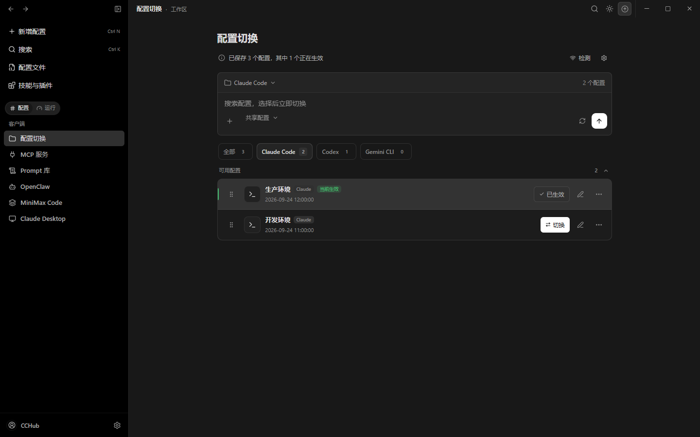
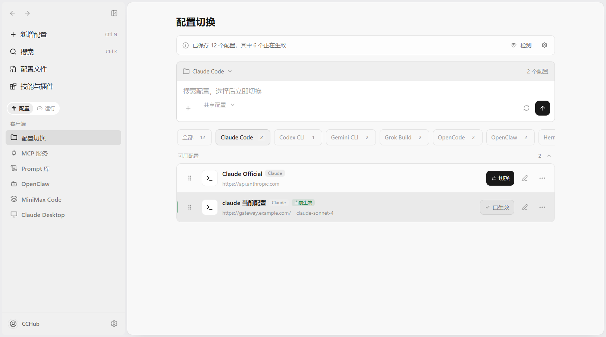
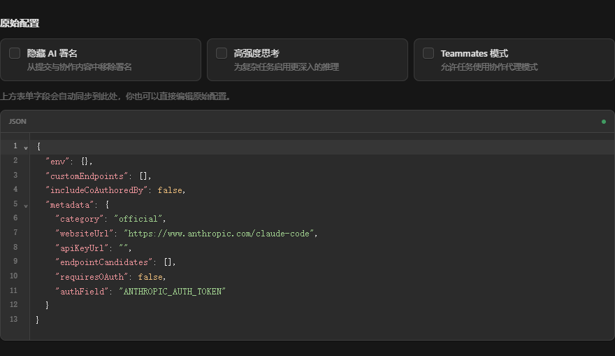
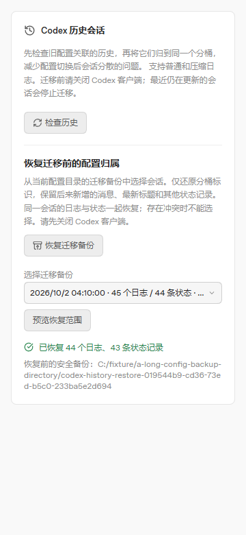
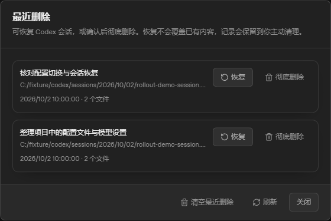
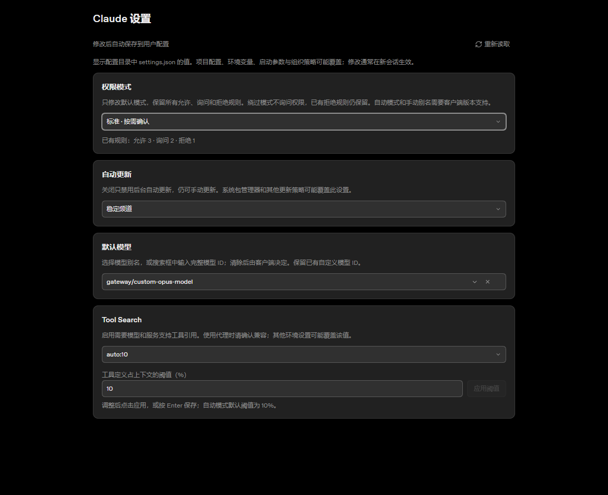
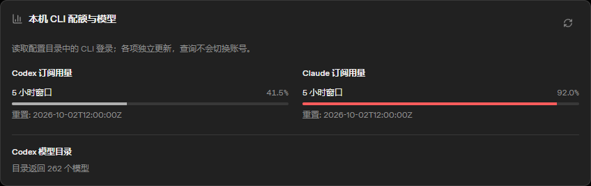
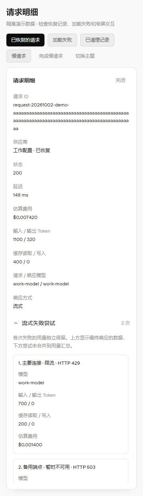

<div align="center">


# CCHub

### Switch AI coding tool configurations from one desktop app.

[](https://github.com/Moresyl/cchub/stargazers)
[](https://github.com/Moresyl/cchub/releases)
[](https://github.com/Moresyl/cchub/releases)
[](LICENSE)
[](https://tauri.app)

**Windows** · **macOS** · **Linux** &nbsp;|&nbsp; [中文](README.zh-CN.md) · English

[**Download**](https://github.com/Moresyl/cchub/releases/latest) &nbsp;&nbsp;·&nbsp;&nbsp; [Report Bug](https://github.com/Moresyl/cchub/issues) &nbsp;&nbsp;·&nbsp;&nbsp; [Request Feature](https://github.com/Moresyl/cchub/issues)

</div>

---

## Purpose

CCHub opens directly into configuration switching. Filter and search saved provider profiles by tool, see which profile is active, and apply another in one click. You can also create, edit, duplicate, ping, and stream-check profiles. Shared providers and project profiles remain available as advanced options.

The compact neutral light/dark workspace uses a unified frameless desktop title bar, native window actions, a collapsible sidebar, and `Ctrl+K` quick switching. New profiles start from an official default or a blank custom template; existing saved profiles remain compatible. Configuration files, MCP servers, and Skills are secondary destinations. The Runtime sidebar view provides proxy management, usage analytics, and session browsing. Former standalone pages such as Autopilot, Marketplace, and security audit are no longer product entry points. Upgrading does not delete existing configuration data.

---

## Workspace

| Dark theme                                          | Light theme                                           |
| --------------------------------------------------- | ----------------------------------------------------- |
|  |  |

Screenshots are from the desktop app; the example endpoint has been anonymized.

### Configuration editor



Model discovery follows the selected API protocol and retains provider-reported context/output limits, modalities, native endpoints, and reasoning levels. Catalogs are saved with their profile and invalidated when its connection changes. OpenCode model edits remain separate when switching models; reported limits and modalities can be applied explicitly, and clearing token limits restores the tool defaults. Discovery uses a single 15-second deadline across supported pagination, with limits of 50 pages, 10,000 model rows, and 8 MiB.

---

## Features

| Feature              | Description                                                                                    |
| -------------------- | ---------------------------------------------------------------------------------------------- |
| **Config Profiles**  | Save and apply configurations for Claude Code, Codex, Gemini, and more                         |
| **Providers**        | Tool filters, search, presets, ping, stream checks, and shared profiles                        |
| **Config Files**     | View and edit managed tool configuration files                                                 |
| **MCP Servers**      | Scan, edit, and sync MCP configurations across tools                                           |
| **Skills & Plugins** | Browse, edit, and sync Skills across tools                                                     |
| **Quick Switch**     | `Ctrl+K` to find/apply profiles or navigate to configuration pages                             |
| **Native Configs**   | OpenCode switching preserves JSONC comments, MCP, plugins, and other providers                 |
| **Sessions & Usage** | Browse native sessions and import output, reasoning, and cache usage without duplicate billing |

### Sessions and recovery

Codex session browsing, details and usage imports support both `.jsonl` and compressed `.jsonl.zst` logs. The plain file takes precedence while both forms exist. Selection and record IDs survive compression, so repeated imports do not bill the format change twice. Damaged archives or decoding-limit errors discard that file's staged import results.

Deleting a Codex session retains original copies of the selected log and its plain/compressed twin in Recently deleted. Files updated within the last minute are refused. Restore verifies identity and content hashes, preserving existing files with different content. Shared client indexes and databases stay unchanged; recovery does not include other segments or subagents of the same thread. Other apps' deletions cannot be restored here. Bulk deletion reports each outcome, removes successful items and lets you retry only failed items.

Recently deleted also supports Delete forever and Empty recently deleted with an in-app confirmation naming the selected sessions. Emptying applies only to the entries and revisions in that preview; later additions remain. Cleanup checks the recovery note and file metadata before each removal, refuses symbolic links, nested folders and unknown files, and reports partial failures for a fresh review and retry. It removes recovery copies only, without touching current session logs or shared indexes. Deletion is irreversible and may partially complete on failure; this is not a filesystem transaction. There is no automatic expiry. Cancelling returns focus to the initiating control, errors hide raw details, and the system's reduced-motion preference disables UI animations.

Session list/detail reads and deletion/recovery use background file workers, leaving the configuration database available during file processing. Reads run with bounded concurrency; deletion, recovery, trash cleanup and recovery-list reads share one queue. Cancelling a wait does not release the queue while a file worker is still running.

Codex history migration in Integration settings previews source/target buckets, plain/compressed files and state-row counts before confirmation. Default sources are old buckets declared in the current Codex configuration. Execution checks the preview revision and requires another review if history changed. Logs updated within the last minute are refused. Migration shares the background deletion/recovery queue without holding the configuration database during file processing.

Original logs, consistent state-database snapshots including WAL data and a migration journal are retained before writes. Failures roll back changes still owned by this operation and preserve newer external edits; incomplete rollback reports the original-copy path. This is not a process-crash or power-loss transaction, nor proof that full backup recovery covers all client data.

Integration settings can also preview and selectively reverse a history migration. Backups are bound to the current configuration directory. Sessions are grouped with their logs and state rows; conflicts and already-restored sessions cannot be selected. Recovery changes only the proven provider field, retaining later messages, latest titles and unrelated database rows. Both existing plain/compressed copies are updated, and packing a log after migration is supported. A stale preview requires another check, and safety copies are retained before recovery writes. Missing or damaged backup evidence stops recovery; this workflow does not restore deleted sessions or replace complete databases from old SQL exports.

集成设置支持预览并选择恢复历史迁移前的配置归属。备份必须属于当前配置目录；同一会话的日志和状态记录一起选择，冲突与已恢复项不能选择。恢复只修改经原始备份验证的分桶标识，保留后续消息、最新标题和无关记录，支持现存普通与压缩副本，以及迁移后压缩的日志。预览失效后必须重新检查，写入前保留安全副本。此流程不替代已删除会话恢复，也不会用旧 SQL 导出的整个数据库覆盖现有状态。



This screenshot shows the actual settings components with isolated demonstration data; it is not a native desktop acceptance result.



This screenshot shows the actual page component with isolated demonstration data, not a native desktop acceptance result.

### Prompt library

Manage instruction versions for Claude, Codex, Gemini, OpenCode, OpenClaw, Hermes and Pi with Markdown editing, preview and search. Importing retains the file's exact contents; replacing live instructions retains the previous contents as another library entry. Deleting an entry preserves the tool's live file. The page reports file-read errors and mismatches instead of treating unreadable content as an empty file or claiming a mismatched version is active.

Saves check the loaded library and file revisions. Conflicts retain the draft until you reload and review the current file or stored version. Writes are serialized, and late responses cannot replace another tool's state. Reported database commit failures roll back file writes still owned by the save; newer external edits are preserved. This recovery does not cover a crash or power loss.

### Tool settings

Tools > Claude reads the configured `settings.json` and preserves existing permission rules while changing the native starting mode. Exact custom model IDs, unset defaults and tool-search thresholds remain visible. Saves require the loaded revision of both user and legacy local settings; choosing a tool-search value explicitly moves that field to user settings without removing other local fields. Invalid JSON, duplicate fields and stale reads prevent writes. Pending or failed writes keep the last confirmed values, with masked errors and reload recovery. Turning off background updates retains the channel and does not disable manual updates or override other update policies.

工具 > Claude 读取指定目录中的 `settings.json`，修改原生默认权限模式时保留已有允许、询问和拒绝规则。自定义模型 ID、未指定默认值和工具搜索阈值都会原样显示，百分比阈值支持输入后点击应用或按 Enter 保存。保存前核对用户配置与旧版本地配置的版本；主动选择工具搜索值时，迁移该字段到用户配置，保留其他本地字段。JSON 格式错误、重复字段和过期读取会阻止写入。保存中或失败时保留上次确认值，错误信息脱敏并支持重新读取。关闭后台更新保留更新频道，不禁用手动更新，也不覆盖其他更新策略。



This screenshot uses actual settings components and isolated demonstration data; it is not native desktop acceptance evidence.

Tools > Codex reads the configured user settings file and checks its location and content revision before saving. Permission presets update `approval_policy` and `sandbox_mode`, preserving valid reply styles, comments and unrelated settings; granular or named permission policies remain custom until explicitly changed. A selected configuration profile keeps the global permissions control read-only. Failed reads do not invent defaults, and failed writes retain the last confirmed values until reload. The 1M toggle removes only a 1M override when disabled, preserving other context limits. The legacy response-storage field is retained for compatibility and does not guarantee that local or server records are disabled.

工具 > Codex 使用设置中指定的用户配置文件，保存前核对路径与内容版本。权限预设正确更新 `approval_policy` 和 `sandbox_mode`，保留有效回复风格、注释与无关设置；细粒度或命名权限策略会保留为自定义配置，直到主动修改。选择了配置档案时，全局权限控件保持只读。读取失败不会伪造默认值，写入失败保留上次确认值并要求重新读取。关闭 1M 开关只移除 1M 覆盖值，保留其他上下文上限。旧版响应存储字段仅用于兼容，不能保证本地或服务端停止记录。

Codex reasoning settings sit beside the selected model and use its reported levels. An explicit empty list offers no configurable level; missing capability information retains the usual choices and any saved custom value. Unsupported saved values stay visible with a warning until explicitly changed. Profile, configuration-file and tool-settings editors share a “Use model default” choice that omits `model_reasoning_effort`, while a literal `none` remains a distinct value. Startup proxy reapplication preserves an omitted effort; an explicit profile switch follows the selected profile instead. Configuration-file edits retain comments and unrelated MCP settings.

Codex 配置页将推理强度放在模型选择旁，按当前模型报告的等级显示选项。明确为空时不提供额外等级；未报告能力时保留常用选项和已有自定义值。未被报告支持的原值会提示并保留，直到主动修改。配置管理、配置文件和工具设置共用“使用模型默认值”，保存时移除 `model_reasoning_effort`；字面值 `none` 与默认值区分。启动代理时保留已经清除的强度，主动切换配置则遵循所选配置。配置文件编辑保留注释和无关 MCP 设置。

CLI and managed-account model discovery preserve reported context/output limits, input modalities, reasoning levels and defaults. Duplicate rows enrich one model; hidden entries stay out of the picker without changing saved model IDs. Missing or malformed capabilities remain unknown. Defaults are displayed as hints and are not written automatically. Invalid catalog containers fail explicitly. CLI catalog responses are limited to 2 MiB and a 15-second deadline; query errors omit upstream bodies and sensitive transport details. Catalog discovery does not prove inference access.

CLI 与托管账户的模型发现保留报告的上下文／输出上限、输入模态、推理等级与默认值。重复记录合并补全，隐藏项不进入选择器，也不改写已有模型 ID。缺失或损坏的能力保持未知，默认等级只提示，不自动写入配置。错误的目录结构会明确报错。CLI 目录查询限制为 2 MiB 和 15 秒，错误提示不显示上游正文或敏感网络详情；发现模型不等于验证推理权限。


This screenshot shows the actual model editor with isolated demonstration data, not a native desktop acceptance result.

The local CLI quota card updates Codex usage, Claude usage and the model catalog independently. Failed refreshes keep last results labeled as such, with separate retry guidance and no credential/error-body disclosure. Loading and authentication states remain visible; refresh uses the shared control, and usage bars have accessible labels.

本机 CLI 配额卡片独立更新 Codex 用量、Claude 用量与模型目录。刷新失败保留并标明上次结果，各项提供单独的失败提示，不显示凭据或错误正文。加载与认证状态明确可见，刷新按钮使用统一控件，用量条提供无障碍标签。



This is the actual quota component with isolated demonstration data, not a live subscription or native desktop acceptance result.

The Codex file editor counts API-key-only edits as unsaved changes. It saves the raw TOML draft together with a field-level authentication update, checking the exact loaded revision of both files before writing. Malformed authentication and invalid TOML stop the complete save. A reported write failure rolls back changes still owned by this save; newer external edits are preserved, and incomplete recovery retains original files with a recovery path. This is not a power-loss transaction. Late file reads and save acknowledgements cannot replace another file or newer drafts. Editor actions and file navigation use the shared controls.

Claude local option switches preserve JSONC comments, formatting and unrelated settings. Empty, malformed, duplicate-key or non-object configurations and invalid `env` values stop the edit with an error. Switching an already-disabled absent option off leaves the file untouched, including when the file does not exist.

### Local proxy and failover

Chat forwarding preserves historical reasoning by default. On `api.mistral.ai`, recognized plain-text assistant reasoning is converted to native thinking content while retaining tool calls and existing content parts. Encrypted, signed or unknown reasoning details are not converted automatically. Other endpoints are retried only for HTTP 400/422 structured `extra_forbidden` errors identifying an existing assistant reasoning field; unrelated errors keep their status, headers and body. Each endpoint permits at most three history repairs, sharing its original timeout, and failover starts from the original prepared history.

Successful history compatibility rules are retained in bounded memory for ten minutes, isolated by tool, profile, configuration revision, actual endpoint, model and managed-account login revision. Only a completed Chat JSON reply or stream commits a newly learned rule; failed repairs and interrupted streams do not. Tool-call links, untouched history bytes and opaque numeric spellings are preserved. This does not guarantee that encrypted history is portable between providers.

Native Responses and compaction forwarding repair legacy tool-search item IDs with incorrect prefixes. The repair preserves `call_id` links, encrypted reasoning and all other history bytes; valid IDs remain unchanged, and renamed IDs avoid collisions with existing history. This does not make encrypted history portable between providers.

The configuration editor supports provider-local model aliases, applied only through the local proxy. Exact requested model names take precedence over `*`; every `*` in an upstream name expands to the current model, for example `vendor/*`. Aliases apply after request overrides and global model mapping, independently for each failover candidate. They do not rename catalog, routing or conversation identities. Accounting retains the requested, sent and actual response models: a response confirming the alias uses canonical pricing and aggregation, while a different served model uses its own price and group. Recorded wire names preserve historical model classification after later alias edits. Paired fields provide wire previews, duplicate and length validation, and preserve malformed imported data until explicitly repaired or cleared. Limits are 128 rules and 1024 UTF-8 bytes per name or expanded result.

Advanced proxy settings support separate routing policies for Claude, Codex, Gemini, Grok Build, OpenCode, OpenClaw and Hermes. Groups can prioritize members in order, rotate the starting member per request, or select one fixed profile. Nested groups retain their own strategy and repeated profiles are deduplicated; cycles and more than eight group levels are rejected. The current active profile is retained. Rules run top to bottom and combine model matching, images, reasoning and minimum request bytes. Unmatched requests use the default group or the existing active-profile order.

Preview draft rules locally, including a simulated byte size, without sending model requests, saving settings or advancing rotation. Saving checks the exact loaded revision; conflicts retain the draft and never retry an overwrite. Routing stays within the selected group and still respects retry budgets and circuit breakers. A deleted selected member stops routing with an error instead of silently choosing a profile outside the group.

Conversation routing defaults to off, with automatic, session and tool-turn modes available. Only explicit client session identifiers are used; identical prompts do not merge conversations. Tools, credentials, models, reasoning settings and routing policies are isolated. Automatic mode retains tool continuations or a successful response reporting at least 1024 cached input tokens for five minutes; session mode retains bindings for up to 24 hours. Only successful replies update bindings, and streams must deliver their completion event. Managed accounts stay pinned through default-account changes, while invalid logins, configuration changes and circuit breakers still apply. Bindings live in bounded memory without changing profile files; this does not guarantee encrypted reasoning history can be replayed across providers.

Quota-aware selection is an explicit advanced-routing option, off by default. Query account usage first: fresh observations from the same login can skip confirmed exhausted Codex or Copilot quota for up to five minutes. Copilot premium quota only applies to models whose account catalog reports premium billing with a positive multiplier; free and unknown models remain eligible. Unknown, stale or failed observations do not block requests, and reported unlimited quota, overage permission or usable credits prevent a false skip. Filtering uses the final model after profile aliases, stays inside selected or fixed groups, consumes no failure retry and does not change the active profile. When every selected candidate is confirmed exhausted, the proxy returns HTTP 429 with a bounded retry delay; no usage or circuit failure is fabricated. Rule previews show candidate order and do not query quotas. Other providers retain their existing routing behavior.

Alternate endpoints are attempted in order. A profile records one failure after its available endpoints are exhausted. Disabling cross-profile failover or exhausting its retry budget preserves the vendor's HTTP status, error body, and `Retry-After`. Open circuits are not bypassed; when every candidate is blocked, the proxy returns HTTP 503 with a retry delay.

Recovery allows one probe at a time, and cancellation releases its slot. Health is recorded after the response body finishes; streams also check vendor error events and completion markers, preserving split Unicode characters and handling CRLF boundaries. Closing a response after reading its complete terminal event still records success and releases the recovery slot. Cancelling before the translated terminal event is read remains cancellation, even if the upstream event has already completed. Chat, Responses, and Gemini adapters forward errors rather than fabricate normal completion after interruption. Late requests cannot change a newer circuit state after a reset or another opening.

Before committing stream headers, the proxy briefly inspects known initialization and heartbeat events. An explicit retryable error cancels the upstream body immediately and tries the next configured endpoint/profile within the existing retry budget, even if the failed server keeps its socket open. Messages, Chat, Responses and Gemini are supported, including translated streams. Inspection stops after 256 KiB or one second and replays the original bytes. Text, reasoning, refusal, tool output, unknown events and terminal events commit immediately; the proxy never retries after committing. Invalid-request errors return directly.

流式响应提交给客户端前，代理短暂检查已知初始化和心跳事件。遇到可重试的明确错误时，立即取消上游读取，按已有重试预算切换端点或配置，无需等待服务端关闭连接。支持 Messages、Chat、Responses、Gemini 及协议转换；检查最多保留 256 KiB、等待一秒，达到上限后按原始字节转发。正文、思考、拒绝、工具输出、未知事件和结束事件立即提交，提交后不再重试；请求参数错误直接返回。

Request details retain failed stream attempts separately, including their profile, model, status, reported tokens and estimated cost. These details survive SQL backup/restore and are removed with their parent request. Current usage summaries still describe the final request outcome; failed attempts are not added to those totals. If failure accounting cannot be retained, the proxy stops before asking another provider. The detail panel offers retry after a load failure, wraps long IDs/models, and ignores responses arriving after a different selection or closing the panel.

请求明细可展开查看流式失败尝试的配置、模型、状态、已报告用量和估算费用。明细随 SQL 备份恢复，也随所属请求一起清理。当前用量汇总仍统计最终请求结果，未合并这些失败尝试；若失败用量无法保存，代理不会继续请求其他供应商。明细加载失败可直接重试，长 ID 和模型名自动换行，切换记录或关闭后，迟到的响应不会覆盖当前界面。



This screenshot shows the actual detail component with isolated demonstration data, not native desktop acceptance.

Messages, Responses, Chat and Gemini passthrough streams emit protocol-specific error events when cut short or interrupted. Passthrough errors name the profile without exposing raw request URLs or credentials. Terminal-event headers are checked separately, so payloads larger than 1 MiB cannot disable completion checks; a transport closure after a whole terminal event does not turn a completed reply into a failure. Partial Gemini input, output, reasoning and cache readings merge as cumulative counters, retain reported usage after interruption, and do not count repeated chunks twice.

Chat, Responses and Gemini stream adapters parse one event at a time, with an 8 MiB limit per normalized SSE event including its newline delimiter. A response can allocate up to 4096 content blocks; Chat can buffer up to 8 MiB of tool arguments awaiting identity. Retained Chat/Responses tool identities and names are limited to 1024 bytes. Overflow, invalid UTF-8 or an unfinished event returns a sanitized API error and records failure without normal completion. Split Unicode, CRLF and multiline data fields are preserved. Chat may finish after an explicit finish_reason without an additional [DONE] sentinel; Gemini without a finish marker remains interrupted.

Chat tool fragments may repeat the same ID/name or omit them while continuing the same indexed call. Changing an established identity or reusing its ID for another index interrupts conversion with a sanitized error; conflicting arguments are not delivered and received usage remains recorded as a failed request. Generated IDs for anonymous calls avoid collisions with explicit IDs.

Streaming usage is captured before protocol conversion, so metadata events omitted by an adapter still reach request accounting. Cancellation and interruption retain native counters and the reported model already read. Gemini candidate and reasoning counters combine even when delivered in separate events; missing or smaller later readings cannot erase earlier values. A total without its input split does not imply output usage.

New proxy records report total input including ordinary input, cache reads and cache writes. Pricing follows the actual upstream protocol: Messages ordinary input is not reduced by cache counts again, while Chat/Responses total input excludes those categories before each configured rate is applied. Nested cache-write fields, Chat's separate final usage chunk and partial Responses readings are retained. Translated Messages responses place only ordinary input in `input_tokens`. Dashboard totals follow each record's convention without adding cached input to new totals a second time. Historical records and native session imports retain their original counting conventions; upgrades do not recalculate historical charges.

Usage statistics follow the final request outcome. Failover does not count the same request twice. Interrupted or errored streams are recorded as failures; cancellation is recorded as 499 while retaining usage already reported. Request details and daily totals are saved together so a failed statistics write cannot leave a partial update.

New streaming request logs include time to first observed text, reasoning or tool output, separately from total request latency. Initialization, role-only, keepalive and usage-only events do not count as output. The estimate uses original upstream events before preflight buffering and protocol conversion. Output rate uses the first-to-last output receipt interval, rather than the later completion or usage event; it is affected by network buffering and client reading speed. Rates are omitted for windows shorter than 100 ms, incomplete outcomes and missing measurements. Historical logs and ordinary JSON responses keep unknown timings instead of inferred values. Failed attempts remain separate from the final response's measurements.

Stream interruption and timeout errors identify the connection failure in the client's protocol. Invalid data and decoding limits remain distinct from transport failures. The proxy does not replay a partially delivered answer through another profile, and these errors do not echo upstream URLs or credentials.

Request deadlines are configured in the advanced proxy settings. Ordinary responses have a per-attempt total deadline covering request transmission, headers, and body (600 seconds by default). Streaming requests allow 60 seconds from transmission to the first raw byte and 120 seconds of upstream inactivity; heartbeats keep the stream alive. A stalled endpoint can fail over before client headers are committed. Set a timeout to `0` to disable it; values above 86400 seconds are rejected. These deadlines do not include credential acquisition or reading the incoming client body.

### Native configuration and usage sync

OpenCode uses the existing `opencode.jsonc` or `opencode.json`. Profiles retain the native provider ID and selected model, SDK extension options, and other model definitions. Applying a profile updates its provider and default model. Invalid syntax, duplicate fields, or an external change detected before writing stops the update with an actionable error.

Choose Runtime → Sessions → Sync usage to import completed requests from OpenCode V1/V2 databases. Totals include cache reads, cache writes, reasoning output, and compaction requests; unfinished responses remain eligible for the next sync. Corrected accounting updates existing records. Migration or moving the database does not import the same requests again. Durable identities survive log cleanup and are included in SQL backups. A result dialog lists errors when some sources could not sync.

### Provider balance and quota

The profile usage dialog shows every reported currency and quota window, including zero balances. Unknown units and missing usage metrics remain unknown; a balance alone does not imply a quota percentage. Built-in balance and Coding Plan queries route only exact official HTTPS hosts; an explicit Coding Plan selection can choose its fixed vendor endpoint. Generic relay queries share a 20-second budget across fallback endpoints, while official queries allow 15 seconds. JSON responses are limited to 2 MiB and credentials never follow redirects to another origin.

Refreshing after a network failure retains the same configuration's last successful reading with a visible stale-data notice. Credential failures replace the result. Switching profiles, tools or configuration invalidates previous readings and late requests. The expandable read-only JSON view supports syntax highlighting and scrolling through long responses.

### Protocol reply compatibility

Chat replies support string content and typed text, thinking and refusal parts in both whole and streamed responses. Messages conversion retains part order, tool identities and trailing usage. Native Chat relays flatten fully understood arrays using field-only edits; unknown or signed parts remain unchanged. Conversion reports unsupported parts explicitly instead of returning an empty success, and never retries after streamed output. Repairs retain existing body/event bounds; whole native replies above the 8 MiB repair cap pass through. Modified replies discard the original body's integrity headers.

Chat 响应兼容字符串正文，以及结构化文本、推理和拒绝内容；流式与非流式均支持。转换为 Messages 时保留内容顺序、工具身份和末尾用量；原样 Chat 转发只修改明确识别的字段，未知或带签名的内容保持原样。无法转换的内容会明确报错，已输出的流式请求不会重放。兼容处理沿用响应和事件的大小限制；超过 8 MiB 修复上限的原样非流式响应直接透传。正文发生修改时移除失效的原始校验头。

Claude protocol conversion gives whole and streamed Chat Completions, Responses and Gemini replies Anthropic message IDs, preserving their tool-call IDs. Missing upstream message IDs receive independent random IDs. Responses streams emit one message start even when the upstream start is absent or repeated, and stop once on completion. Native Anthropic message IDs remain unchanged.

Gemini tool results match historical calls by ID and use the original function name, including parallel calls to the same function and reordered results. Missing reply call IDs receive UUIDs; tool failures retain an error result. Unmatched or repeated history IDs are rejected locally with an API error. Duplicate reply IDs stop conversion without emitting a second tool call or a normal completion, and conversion failures retain reported usage while counting as failures. Tool identity tracking is limited to 4096 calls and 1024 bytes per ID; these limits do not cover the entire parser or reasoning-signature history.

Whole and streamed Gemini replies share usage parsing rules, preserving valid input, output, reasoning and cache readings even without a total token count. Whole replies include reported reasoning tokens in output usage. Accounting keeps the upstream model name, and failover after a conversion failure does not count the request twice.

Responses conversion also supports standard reasoning summary/text events and data-only event types. Reasoning parts keep separate block identities, close before text or tools, and avoid replaying completed snapshots. Final-only parts are recovered when deltas are absent. Reasoning tracking has part and identity limits; adapter errors count as failed requests even when the vendor completed its reply. These limits apply to reasoning state, not the entire stream parser.

Ordinary tools converted to Responses explicitly keep non-strict behavior. Client-provided `strict: true/false` is preserved in both Responses and Chat Completions conversion, without turning optional parameters into required ones. Hosted web search does not receive the function-only `strict` field. Native protocol tool definitions remain unchanged.

### OAuth account status

Claude proxy requests using Codex OAuth, xAI OAuth or GitHub Copilot carry the resolved account and sign-in revision. Unbound profiles follow the default account; explicitly bound profiles retain their chosen account. Codex request account headers use that resolved account too. After account removal or a new sign-in, old requests cannot promote endpoint preferences or emit profile-failover notifications. Grok Build's xAI OAuth proxy uses the same account checks.

Concurrent GitHub Copilot token refreshes share one request. Old results cannot overwrite a new sign-in or restore a removed account. Account persistence uses atomic file replacement; failed saves retain the previous accounts, default selection and cached credentials. Token responses are limited to 2 MiB; empty, expired and invalid responses are not cached, and token endpoint error bodies are not displayed.

Explicitly rejected refresh credentials leave Codex OAuth and xAI OAuth accounts marked as requiring sign-in on this device. Ordinary network or proxy-challenge failures do not clear the account. Old refresh responses cannot overwrite a new sign-in or restore a removed account; cancelling device-code sign-in also cancels the backend flow so later authorization cannot commit. The Codex account panel keeps expired accounts visible with a sign-in action, offers retries for quota failures, and isolates late readings by account.

Codex OAuth quota/model queries and xAI OAuth model queries recover from an HTTP 401 by refreshing and retrying once for the original account. A second rejection marks only that current login as requiring sign-in. Changing the default account does not redirect an in-flight query, and late rejections cannot evict a newer cached token. HTTP 403, rate limits and server/network failures remain query failures. The recovery flow has a 45-second total deadline and a streaming 2 MiB response limit; redirects stay within the initial origin and vendor error bodies are not displayed. xAI quota remains unavailable through this integration and is not estimated.

Copilot quota and model queries support every saved account independently of editor sign-in. Select an account without changing the default; quota and model failures are shown separately, with expandable model details and the reading time. Missing allowances remain unknown, unlimited allowances stay explicit, and fractional remaining counts are supported. Both queries belong to the exact login revision and share a 45-second deadline with bounded 2 MiB responses. Account changes discard stale results, and model HTTP 401 recovery retries once without evicting newer cached tokens or clearing the saved account. Long select options wrap inside the available window width.

Account model details support searching by name, ID or vendor and filtering by billing type. An explicitly reported zero multiplier shows “No premium quota”; premium models show the reported multiplier, while missing or invalid metadata remains “Billing not reported”. Duplicate models share one row; conflicting positive premium multipliers retain the premium classification with an uncertain multiplier. Account UI and quota routing use the same billing interpretation. Multipliers measure premium-request units, not token prices, and do not remove chat quota or subscription limits. Fetched profile catalogs preserve this metadata and show billing badges in model selectors. Long names and price details wrap within narrow windows.

### Balance and quota alerts

Enable alerts in a profile’s usage and balance dialog. Monitoring defaults off and checks approximately every five minutes while CCHub runs; it uses that profile’s configured usage script or provider API. Quota thresholds and balance thresholds are separate, with balances matched by currency or credit unit. Changing the query account pauses monitoring until the settings are saved again. Failed or stale readings do not trigger alerts.

The titlebar notification center retains up to 200 local history entries, supports marking them read, and offers manual checks. Known quota windows alert once per window; windows without reset times and recharged balances use hysteresis to prevent repeated alerts near the threshold. Optional OS notifications retry failed submissions up to six times. “Submitted to system” means the OS accepted the request, not that the user saw it. An interruption between system submission and storing the acknowledgement can result in a repeated OS notification; the in-app event is stored before submission. Cloud restoration preserves this device’s alert settings and history. Local loopback usage endpoints connect directly, so system proxy bypass settings do not interfere with local relays; remote endpoints retain the existing proxy behavior.

### Cloud backup settings

WebDAV passwords and S3 secrets stay in the OS keyring and are bound to their server and account. Changing either requires the corresponding credentials; switching back can reuse that account's saved credential. Save edited settings before reading, uploading, or restoring remote backups. Returning to a visible window refreshes saved settings while the form is idle and unchanged. Background refreshes preserve drafts, discard obsolete responses after editing or saving, and stop updating a closed page. Changing the S3 signing region clears cached remote status; a custom endpoint can retain its saved backup password when the account and backup location are unchanged. Restoring asks before replacing the local database, locks competing actions while confirmation is open, and permits retry after cancellation.

Cloud restoration keeps this device's cloud accounts and backup-password settings, custom tool directories, proxy, window and terminal preferences, and existing workspace directory bindings. Shared libraries such as provider fragments, common configuration, universal providers, skill repositories and request optimization settings are restored from the backup. New workspaces need local directory selection. Project files remain pending migration even when their original path exists on this device. Transfer success and error status updates apply only to the original backup location; an older request cannot overwrite another account's status after settings change. Uploads and restores are serialized across both cloud adapters. Local SQL-file imports still restore the full archive.

Cloud restores, local SQL imports and managed-backup restores clear old configuration query caches and refresh the migration summary, pending projects and local paths. The import summary shows restored counts and the safety-backup location; pending project mappings open automatically. A view-refresh failure is reported separately from an already completed restore.

Set and save a backup password of at least 12 characters before uploading. It is stored separately from the server login and scoped to the server, account, and backup location. New backups use AES-256-GCM with PBKDF2-SHA256 and a random salt. Other devices need the same backup password to restore. Keep it safe, and retain old passwords if you change it: earlier encrypted backups still require their original password. Disable automatic uploads before removing the saved backup password.

Downloads stop at 64 KiB for manifests and 15 MiB of backup content (encrypted files allow 68 additional bytes for format overhead). Restoring checks paths, declared sizes, SHA-256, and authenticated decryption before import. An incorrect password or modified encrypted content stops the import. Legacy unencrypted backups require explicit consent; older WebDAV backups without a digest still receive size checks. Each upload uses a separate snapshot filename.

Uploads use conditional writes: snapshots are created only if absent, and manifests replace only the strong ETag revision just read. A change during review or upload stops the operation without an unconditional retry. When first connecting to an existing backup or discovering another device's revision, restore it first or explicitly confirm replacement during manual upload; confirmation applies only to that exact revision. Automatic uploads cannot replace an unaccepted revision, and deleted backups require manual confirmation before recreation. Successful uploads and restores record this device's accepted revision in the OS keyring, outside database backups. Storage without strong ETags or conditional-write support remains available for downloads but stops uploads. Replacing the manifest does not delete previous snapshot files.

HTTP 429 and 503 pause requests to the affected cloud account. Server `Retry-After` values (seconds or HTTP dates) are honored up to six hours; without a valid value, repeated limits wait 30, 60, then 120 minutes. The wait applies to connection tests, remote reads, uploads and restores, including other profiles or buckets using the same endpoint and account. Other accounts remain usable. Manual actions report the remaining wait; automatic uploads skip waiting accounts without repeated error notifications and resume on a scheduled cycle after the wait. Successful connection tests, uploads or restores reset expired failure history. Retry state lasts for the running application session. Missed automatic-sync ticks are skipped instead of issuing catch-up uploads, and failed requests are never automatically replayed.

Automatic uploads recheck the current account, enable switches and wait state when their turn starts. Turning off automatic synchronization while a task is queued prevents that task from uploading. Tasks skipped because of a new wait do not replace the previous synchronization status or emit another failure notification.

Backup imports validate tool identifiers, relative paths and encoded content, rejecting traversal, Windows device names, malformed content and descendant symbolic links or junctions below the selected root. Original files are staged before writing. A tool, artifact or database-update failure rolls back earlier file changes and retains the original database. If rollback itself fails, original files and a recovery path map are retained and their location is reported. Database installation retains the existing connection, so other operations cannot read a temporary empty database. Project-path migration also rolls back path records and file changes on failure; automatic recovery after process interruption is not implemented.

SQL backups load into a temporary database using the application's existing tables and indexes. External database access, schema replacement, triggers and SQL functions are refused. Invalid data or a timeout rolls back the SQL import, and errors do not echo backup contents.

### Platform

| Feature                | Description                                                                   |
| ---------------------- | ----------------------------------------------------------------------------- |
| **Cross-platform**     | Windows 10/11, macOS 10.15+, Linux                                            |
| **Dark / Light Theme** | Compact desktop UI with keyboard focus states and reduced-motion support      |
| **Backup & Restore**   | Export all configs as SQL, import with legacy format support                  |
| **Auto Update**        | Signed Tauri updater when available, with a reliable GitHub Releases fallback |
| **i18n**               | Chinese, English, Japanese                                                    |
| **System Tray**        | Minimize to tray on close                                                     |

---

## Download

| File                                                                       | Platform | Description                                                         |
| -------------------------------------------------------------------------- | -------- | ------------------------------------------------------------------- |
| [`CCHub_x64-setup.exe`](https://github.com/Moresyl/cchub/releases/latest)  | Windows  | **Recommended** — branded bilingual NSIS installer with auto-update |
| [`CCHub_x64_en-US.msi`](https://github.com/Moresyl/cchub/releases/latest)  | Windows  | Branded MSI format for enterprise deployment                        |
| [`CCHub_aarch64.dmg`](https://github.com/Moresyl/cchub/releases/latest)    | macOS    | Apple Silicon (M1/M2/M3/M4)                                         |
| [`CCHub_x64.dmg`](https://github.com/Moresyl/cchub/releases/latest)        | macOS    | Intel                                                               |
| [`CCHub_amd64.deb`](https://github.com/Moresyl/cchub/releases/latest)      | Linux    | Debian / Ubuntu                                                     |
| [`CCHub_amd64.AppImage`](https://github.com/Moresyl/cchub/releases/latest) | Linux    | Universal AppImage                                                  |
| [`CCHub_x86_64.rpm`](https://github.com/Moresyl/cchub/releases/latest)     | Linux    | Fedora / RHEL                                                       |

---

## Tech Stack

| Layer      | Technology                                                                     |
| ---------- | ------------------------------------------------------------------------------ |
| Framework  | [**Tauri 2.0**](https://tauri.app) — Rust backend + Web frontend, ~20MB binary |
| Frontend   | **React 19** + **TypeScript** + **Tailwind CSS 4**                             |
| Backend    | **Rust** — High perf, memory safe, single binary                               |
| Database   | **SQLite** (rusqlite) — Zero-dependency local storage                          |
| Build      | **Vite 6** + **pnpm**                                                          |
| Data Layer | **TanStack React Query** — Unified caching & state                             |
| UI         | CCHub design system + **Tailwind CSS 4** + **cmdk** + **Lucide**               |

---

## Development

### Prerequisites

- [Node.js](https://nodejs.org) >= 20
- [pnpm](https://pnpm.io) 10.32.1
- [Rust](https://rustup.rs) stable
- [Tauri 2.0 Prerequisites](https://v2.tauri.app/start/prerequisites/)

### Quick Start

```bash
git clone https://github.com/Moresyl/cchub.git
cd cchub
pnpm install
pnpm tauri dev
```

### Build

```bash
pnpm tauri build
```

Windows installer artwork, localization, and validation are documented in [docs/WINDOWS_INSTALLER.md](docs/WINDOWS_INSTALLER.md).

---

## Supported Config Sources

CCHub auto-scans MCP server configs from:

| Path                                           | Source                                      |
| ---------------------------------------------- | ------------------------------------------- |
| `~/.claude/plugins/**/.mcp.json`               | Claude Code plugins (recursive)             |
| `%APPDATA%/Claude/claude_desktop_config.json`  | Claude Desktop                              |
| `~/.cursor/mcp.json`                           | Cursor                                      |
| `~/.codex/config.toml`                         | Codex CLI                                   |
| `~/.gemini/settings.json`                      | Gemini CLI                                  |
| `~/.hermes/cli-config.yaml` + `~/.hermes/.env` | Hermes Agent (NousResearch) — YAML + dotenv |

---

## Contributing

Contributions welcome! See [issues](https://github.com/Moresyl/cchub/issues) for ideas.

```
Fork → Branch → Commit → Push → Pull Request
```

---

## Star History

<div align="center">

If CCHub saves you time, consider giving it a star. It helps others discover the project.

[](https://star-history.com/#Moresyl/cchub&Date)

</div>

---

## License

MIT License — see [LICENSE](LICENSE) for details.

## Acknowledgments

- [Tauri](https://tauri.app) — Lightweight desktop framework
- [Claude Code](https://docs.anthropic.com/en/docs/claude-code) — AI coding assistant
- [MCP](https://modelcontextprotocol.io) — Model Context Protocol
