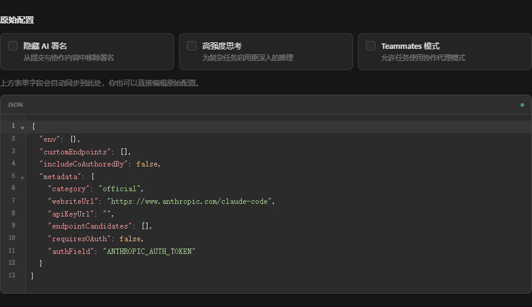

<div align="center">


# CCHub

### 一个桌面应用，切换 AI 编程工具配置

[](https://github.com/Moresyl/cchub/stargazers)
[](https://github.com/Moresyl/cchub/releases)
[](https://github.com/Moresyl/cchub/releases)
[](LICENSE)
[](https://tauri.app)

**Windows** · **macOS** · **Linux** &nbsp;|&nbsp; 中文 · [English](README.md)

[**立即下载**](https://github.com/Moresyl/cchub/releases/latest) &nbsp;&nbsp;·&nbsp;&nbsp; [反馈问题](https://github.com/Moresyl/cchub/issues) &nbsp;&nbsp;·&nbsp;&nbsp; [功能建议](https://github.com/Moresyl/cchub/issues)

</div>

---

## 用途

CCHub 以配置切换为主工作区。按工具筛选并搜索已保存的 Provider 配置，查看当前生效状态，一键应用；也可新建、编辑、复制、测速和检查流式连接。跨工具共享 Provider 和项目配置档案保留为按需展开或在设置中管理的高级选项。

界面采用紧凑的明暗中性主题，支持折叠侧栏与 `Ctrl+K` 快速应用配置。配置文件、MCP 服务和 Skills 位于辅助导航中。此前的 Autopilot、会话统计、Marketplace、安全审计等独立页面不再作为当前产品入口；升级不会删除已有配置数据。

---

## 工作台预览

| 深色主题                                        | 浅色主题                                         |
| ----------------------------------------------- | ------------------------------------------------ |
|  |  |

### 配置编辑器



---

## 核心功能

| 功能              | 说明                                                       |
| ----------------- | ---------------------------------------------------------- |
| **配置切换**      | 保存并一键应用 Claude Code、Codex、Gemini 等工具的配置档案 |
| **Provider 管理** | 工具筛选、搜索、预设、连接测速、流式检查及跨工具共享配置   |
| **配置文件**      | 查看和编辑受管理工具的配置文件                             |
| **MCP 服务**      | 扫描、编辑与同步各工具的 MCP 配置                          |
| **技能与插件**    | 浏览、编辑与跨工具同步 Skills                              |
| **快速切换**      | `Ctrl+K` 搜索并应用配置，或跳转到保留的配置管理页面        |

### 平台特性

| 功能              | 说明                                                         |
| ----------------- | ------------------------------------------------------------ |
| **跨平台**        | Windows 10/11、macOS 10.15+、Linux                           |
| **深色/浅色主题** | 紧凑桌面端界面，支持键盘焦点与减少动态效果                   |
| **备份恢复**      | 配置导出为 SQL，支持导入旧版格式                             |
| **自动更新**      | 优先使用签名 Tauri 更新包，并提供可靠的 GitHub Releases 回退 |
| **多语言**        | 中文、英文、日文                                             |
| **系统托盘**      | 关闭窗口最小化到托盘                                         |

---

## 下载安装

| 文件                                                                       | 平台    | 说明                                                |
| -------------------------------------------------------------------------- | ------- | --------------------------------------------------- |
| [`CCHub_x64-setup.exe`](https://github.com/Moresyl/cchub/releases/latest)  | Windows | **推荐** — 品牌化中英双语 NSIS 安装包，支持自动更新 |
| [`CCHub_x64_en-US.msi`](https://github.com/Moresyl/cchub/releases/latest)  | Windows | 品牌化 MSI 格式，适合企业部署                       |
| [`CCHub_aarch64.dmg`](https://github.com/Moresyl/cchub/releases/latest)    | macOS   | Apple Silicon (M1/M2/M3/M4)                         |
| [`CCHub_x64.dmg`](https://github.com/Moresyl/cchub/releases/latest)        | macOS   | Intel                                               |
| [`CCHub_amd64.deb`](https://github.com/Moresyl/cchub/releases/latest)      | Linux   | Debian / Ubuntu                                     |
| [`CCHub_amd64.AppImage`](https://github.com/Moresyl/cchub/releases/latest) | Linux   | 通用 AppImage                                       |
| [`CCHub_x86_64.rpm`](https://github.com/Moresyl/cchub/releases/latest)     | Linux   | Fedora / RHEL                                       |

---

## 技术栈

| 层       | 技术                                                                      |
| -------- | ------------------------------------------------------------------------- |
| 桌面框架 | [**Tauri 2.0**](https://tauri.app) — Rust 后端 + Web 前端，安装包仅 ~20MB |
| 前端     | **React 19** + **TypeScript** + **Tailwind CSS 4**                        |
| 后端     | **Rust** — 高性能、内存安全、单文件分发                                   |
| 数据库   | **SQLite**（rusqlite）— 零依赖本地存储                                    |
| 构建     | **Vite 6** + **pnpm**                                                     |
| 数据层   | **TanStack React Query** — 统一缓存与状态管理                             |
| UI 组件  | CCHub 设计系统 + **Tailwind CSS 4** + **cmdk** + **Lucide**               |

---

## 开发指南

### 环境要求

- [Node.js](https://nodejs.org) >= 20
- [pnpm](https://pnpm.io) 10.32.1
- [Rust](https://rustup.rs) stable
- [Tauri 2.0 前置依赖](https://v2.tauri.app/start/prerequisites/)

### 快速开始

```bash
git clone https://github.com/Moresyl/cchub.git
cd cchub
pnpm install
pnpm tauri dev
```

### 构建

```bash
pnpm tauri build
```

Windows 安装器视觉资产、双语文案与校验方式见 [docs/WINDOWS_INSTALLER.md](docs/WINDOWS_INSTALLER.md)。

---

## 扫描路径

CCHub 自动扫描以下配置源：

| 路径                                           | 来源                                              |
| ---------------------------------------------- | ------------------------------------------------- |
| `~/.claude/plugins/**/.mcp.json`               | Claude Code 插件（递归）                          |
| `%APPDATA%/Claude/claude_desktop_config.json`  | Claude Desktop                                    |
| `~/.cursor/mcp.json`                           | Cursor                                            |
| `~/.codex/config.toml`                         | Codex CLI                                         |
| `~/.gemini/settings.json`                      | Gemini CLI                                        |
| `~/.hermes/cli-config.yaml` + `~/.hermes/.env` | Hermes Agent (NousResearch)，YAML + dotenv 双文件 |

---

## 参与贡献

欢迎提交 PR！查看 [Issues](https://github.com/Moresyl/cchub/issues) 获取灵感。

```
Fork → 创建分支 → 提交更改 → 推送 → 发起 PR
```

---

## Star 趋势

<div align="center">

如果 CCHub 帮你省了时间，给个 Star 支持一下，让更多人发现这个项目。

[](https://star-history.com/#Moresyl/cchub&Date)

</div>

---

## 许可证

MIT License — 详见 [LICENSE](LICENSE)。

## 致谢

- [Tauri](https://tauri.app) — 轻量级桌面应用框架
- [Claude Code](https://docs.anthropic.com/en/docs/claude-code) — AI 编程助手
- [MCP](https://modelcontextprotocol.io) — 模型上下文协议
