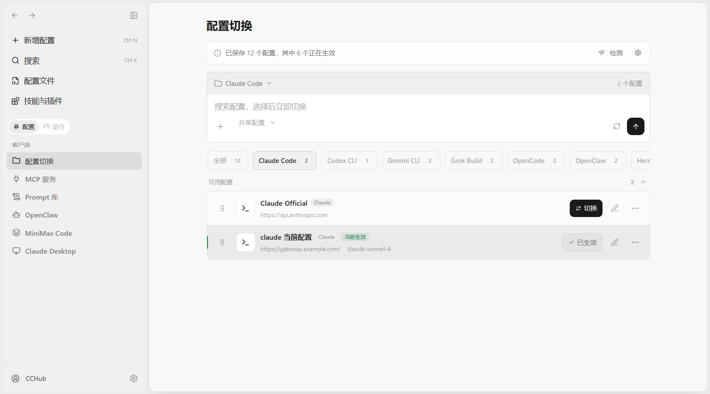

<div align="center">


# CCHub

### 告别手动编辑 JSON，一个应用管理整个 Claude Code 生态

[](https://github.com/Moresyl/cchub/stargazers)
[](https://github.com/Moresyl/cchub/releases)
[](https://github.com/Moresyl/cchub/releases)
[](LICENSE)
[](https://tauri.app)

**Windows** · **macOS** · **Linux** &nbsp;|&nbsp; 中文 · [English](README.md)

[**立即下载**](https://github.com/Moresyl/cchub/releases/latest) &nbsp;&nbsp;·&nbsp;&nbsp; [反馈问题](https://github.com/Moresyl/cchub/issues) &nbsp;&nbsp;·&nbsp;&nbsp; [功能建议](https://github.com/Moresyl/cchub/issues)

</div>

---

## 痛点

Claude Code 生态正在爆发式增长 — MCP 服务、技能、插件、钩子、工作流 — 但管理方式还停留在石器时代：

- 手动编辑 `settings.json`，一个逗号打错全炸
- MCP 配置在不同机器之间手动拷贝
- 装了 30 个 MCP 服务，不知道哪些还能用
- Claude / Codex / Gemini / Hermes 配置互切 = 噩梦
- 对已安装工具的安全风险毫无感知

**CCHub 把这一切搬进一个图形界面。** 一键安装 MCP 服务、一键切换配置、实时健康监控、安全审计。

---

## 截图展示

### 浅色主题



### 深色主题


---

## 核心功能

### 生态管理

| 功能             | 说明                                                                                                                                         |
| ---------------- | -------------------------------------------------------------------------------------------------------------------------------------------- |
| **MCP 服务管理** | 自动扫描 Claude Code、Claude Desktop、Cursor、Codex、Gemini、OpenCode、OpenClaw、Hermes 配置，支持按应用同步、编辑和删除 — 无需手动编辑 JSON |
| **MCP 市场**     | 内置分类注册表，一键安装 + 环境变量配置，支持自定义源                                                                                        |
| **MCP 健康监控** | 命令检测、进程启动测试、延迟测量，一眼看出哪些服务挂了                                                                                       |
| **配置切换**     | Claude Code / Codex / Gemini CLI / OpenCode / OpenClaw / Hermes 配置一键切换                                                                 |
| **技能与插件**   | 浏览、编辑（MDXEditor 富文本）、跨工具同步                                                                                                   |
| **工作流管理**   | 内置 12 个模板（代码审查、TDD、Bug 诊断、安全审计…），一键安装                                                                               |
| **钩子可视化**   | 事件类型、匹配器、命令 — 一目了然                                                                                                            |

### 开发体验

| 功能                        | 说明                                               |
| --------------------------- | -------------------------------------------------- |
| **CLAUDE.md 管理器**        | 可视化编辑项目指令文件，支持模板                   |
| **Autopilot 自动驾驶**      | Claude / Codex 任务编排与自动执行，实时运行监控    |
| **命令面板**                | `Ctrl+K` 快速跳转到任意页面                        |
| **安全审计**                | 环境变量密钥、Shell 执行风险、npx 自动安装风险扫描 |
| **StatusLine (claude-hud)** | 一键安装、代理支持、国内镜像、显示配置             |

### 平台特性

| 功能              | 说明                                                         |
| ----------------- | ------------------------------------------------------------ |
| **跨平台**        | Windows 10/11、macOS 10.15+、Linux                           |
| **深色/浅色主题** | 紧凑桌面端界面，支持跟随系统、键盘焦点与减少动态效果         |
| **备份恢复**      | 配置导出为 SQL，支持导入旧版格式                             |
| **自动更新**      | 优先使用签名 Tauri 更新包，并提供可靠的 GitHub Releases 回退 |
| **多语言**        | 中文、英文、日文                                             |
| **系统托盘**      | 关闭窗口最小化到托盘                                         |

---

## 效率对比

| 操作                    |              没有 CCHub              |     使用 CCHub      |
| ----------------------- | :----------------------------------: | :-----------------: |
| 安装一个 MCP 服务       | 手动编辑 JSON，找 npm 包，配环境变量 |   从市场一键安装    |
| Claude ↔ Codex 切换配置 |       复制文件、重命名、改路径       |  Profiles 一键切换  |
| 检查 MCP 服务是否正常   |          手动跑命令、翻日志          | 健康面板 + 延迟显示 |
| 安全风险审计            |      手动读 JSON、grep 敏感信息      | 自动扫描 + 风险报告 |
| 管理 CLAUDE.md          |         用文本编辑器，记语法         | 富文本编辑器 + 模板 |

---

## 下载安装

| 文件                                                                       | 平台    | 说明                                 |
| -------------------------------------------------------------------------- | ------- | ------------------------------------ |
| [`CCHub_x64-setup.exe`](https://github.com/Moresyl/cchub/releases/latest)  | Windows | **推荐** — NSIS 安装包，支持自动更新 |
| [`CCHub_x64_en-US.msi`](https://github.com/Moresyl/cchub/releases/latest)  | Windows | MSI 格式，适合企业部署               |
| [`CCHub_aarch64.dmg`](https://github.com/Moresyl/cchub/releases/latest)    | macOS   | Apple Silicon (M1/M2/M3/M4)          |
| [`CCHub_x64.dmg`](https://github.com/Moresyl/cchub/releases/latest)        | macOS   | Intel                                |
| [`CCHub_amd64.deb`](https://github.com/Moresyl/cchub/releases/latest)      | Linux   | Debian / Ubuntu                      |
| [`CCHub_amd64.AppImage`](https://github.com/Moresyl/cchub/releases/latest) | Linux   | 通用 AppImage                        |
| [`CCHub_x86_64.rpm`](https://github.com/Moresyl/cchub/releases/latest)     | Linux   | Fedora / RHEL                        |

---

## 技术栈

| 层       | 技术                                                                      |
| -------- | ------------------------------------------------------------------------- |
| 桌面框架 | [**Tauri 2.0**](https://tauri.app) — Rust 后端 + Web 前端，安装包仅 ~20MB |
| 前端     | **React 19** + **TypeScript** + **Tailwind CSS 4**                        |
| 后端     | **Rust** — 高性能、内存安全、单文件分发                                   |
| 数据库   | **SQLite**（rusqlite）— 零依赖本地存储                                    |
| 构建     | **Vite 6** + **pnpm**                                                     |
| 数据层   | **TanStack React Query** — 统一缓存与状态管理                             |
| UI 组件  | CCHub 设计系统 + **Tailwind CSS 4** + **cmdk** + **Lucide**               |

---

## 开发指南

### 环境要求

- [Node.js](https://nodejs.org) >= 20
- [pnpm](https://pnpm.io) 10.32.1
- [Rust](https://rustup.rs) stable
- [Tauri 2.0 前置依赖](https://v2.tauri.app/start/prerequisites/)

### 快速开始

```bash
git clone https://github.com/Moresyl/cchub.git
cd cchub
pnpm install
pnpm tauri dev
```

### 构建

```bash
pnpm tauri build
```

---

## 扫描路径

CCHub 自动扫描以下配置源：

| 路径                                           | 来源                                              |
| ---------------------------------------------- | ------------------------------------------------- |
| `~/.claude/plugins/**/.mcp.json`               | Claude Code 插件（递归）                          |
| `%APPDATA%/Claude/claude_desktop_config.json`  | Claude Desktop                                    |
| `~/.cursor/mcp.json`                           | Cursor                                            |
| `~/.codex/config.toml`                         | Codex CLI                                         |
| `~/.gemini/settings.json`                      | Gemini CLI                                        |
| `~/.hermes/cli-config.yaml` + `~/.hermes/.env` | Hermes Agent (NousResearch)，YAML + dotenv 双文件 |

---

## 路线图

- [x] MCP 服务管理（扫描、按应用同步、编辑、删除）
- [x] MCP 市场（分类注册表、一键安装、自定义源）
- [x] MCP 健康监控（命令检测、启动测试、延迟测量）
- [x] 技能与插件浏览（MDXEditor 富文本、跨工具同步）
- [x] 工作流管理（12 个模板、Markdown 编辑、多工具安装）
- [x] 钩子可视化
- [x] 配置切换（结构化编辑器、多工具切换）
- [x] CLAUDE.md 管理器（编辑器、模板）
- [x] 工具页面（权限控制、StatusLine、Codex 设置）
- [x] StatusLine (claude-hud) 集成
- [x] 安全审计（权限扫描、风险检测）
- [x] 备份与恢复（SQL 导出/导入）
- [x] 自动更新（Tauri 更新器 + GitHub 回退）
- [x] Autopilot 自动驾驶（Claude / Codex 任务编排）
- [x] 命令面板（Ctrl+K）
- [x] hello2cc 插件管理
- [x] 深色/浅色/跟随系统主题
- [x] 多语言（中文 + 英文 + 日文）
- [x] 跨平台（Windows、macOS、Linux）
- [x] 系统托盘
- [ ] 配置变更检测（安全审计时间线）
- [x] 钩子编辑器（从界面创建/编辑钩子）
- [x] WebDAV 云端同步
- [ ] 插件生态（社区 MCP 模板）

---

## 参与贡献

欢迎提交 PR！查看 [Issues](https://github.com/Moresyl/cchub/issues) 获取灵感。

```
Fork → 创建分支 → 提交更改 → 推送 → 发起 PR
```

---

## Star 趋势

<div align="center">

如果 CCHub 帮你省了时间，给个 Star 支持一下，让更多人发现这个项目。

[](https://star-history.com/#Moresyl/cchub&Date)

</div>

---

## 许可证

MIT License — 详见 [LICENSE](LICENSE)。

## 致谢

- [Tauri](https://tauri.app) — 轻量级桌面应用框架
- [Claude Code](https://docs.anthropic.com/en/docs/claude-code) — AI 编程助手
- [MCP](https://modelcontextprotocol.io) — 模型上下文协议
