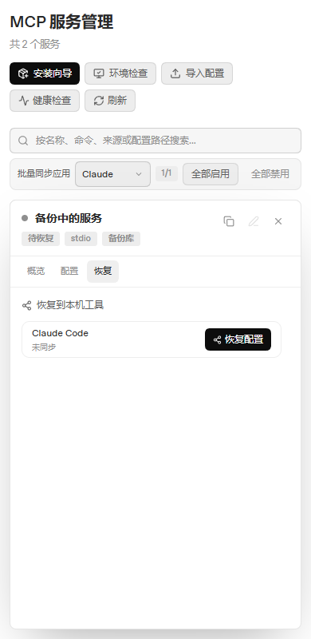
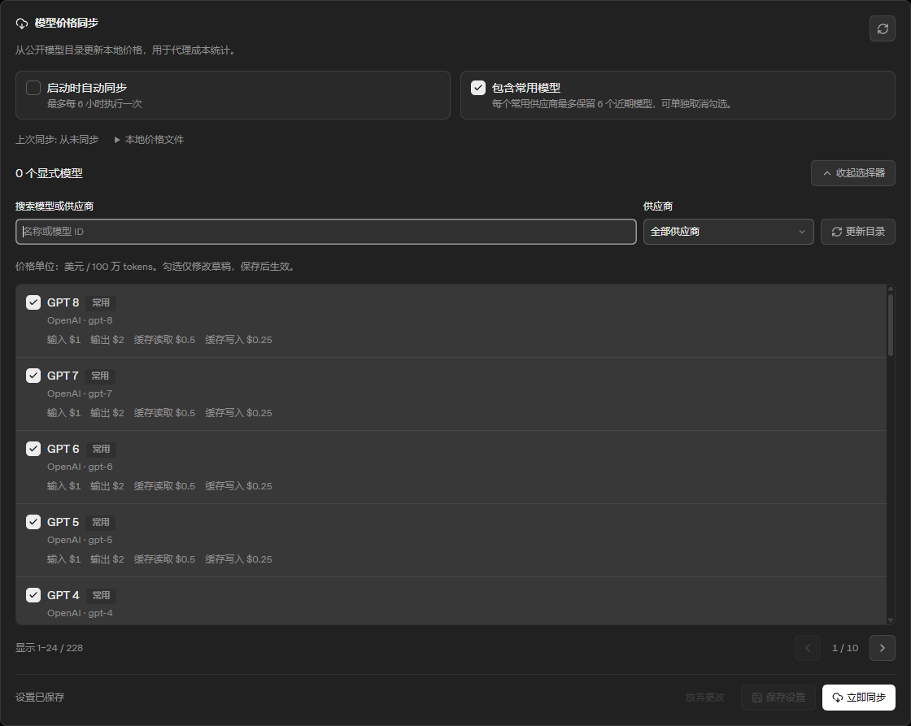
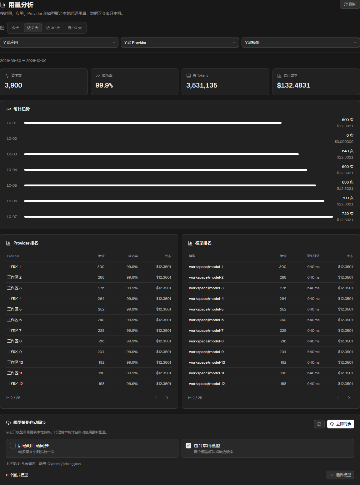
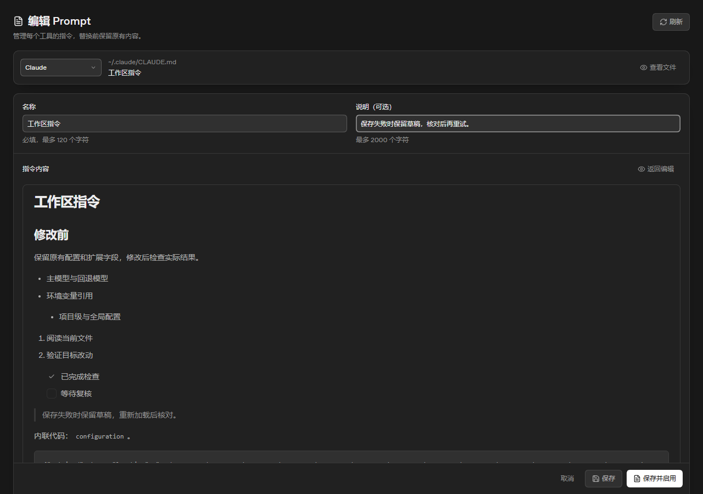
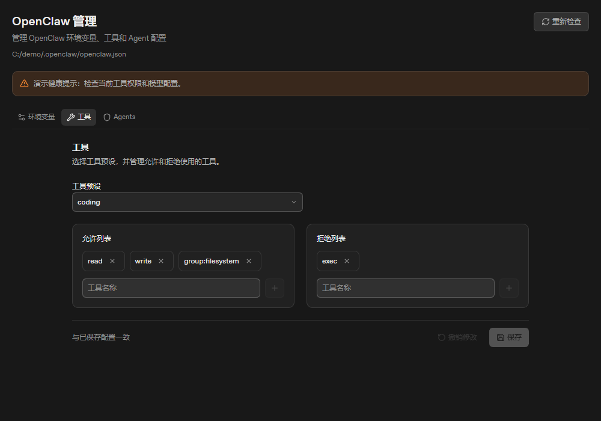
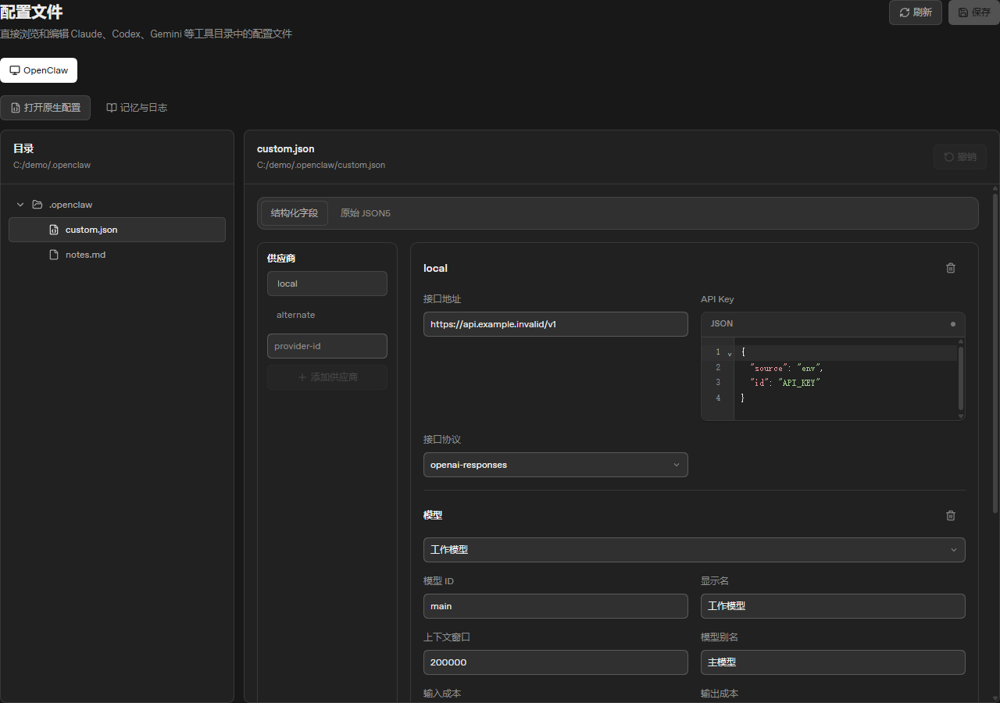
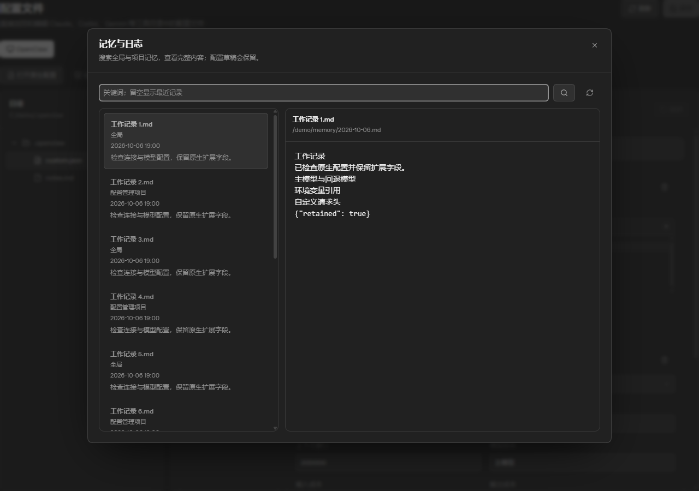
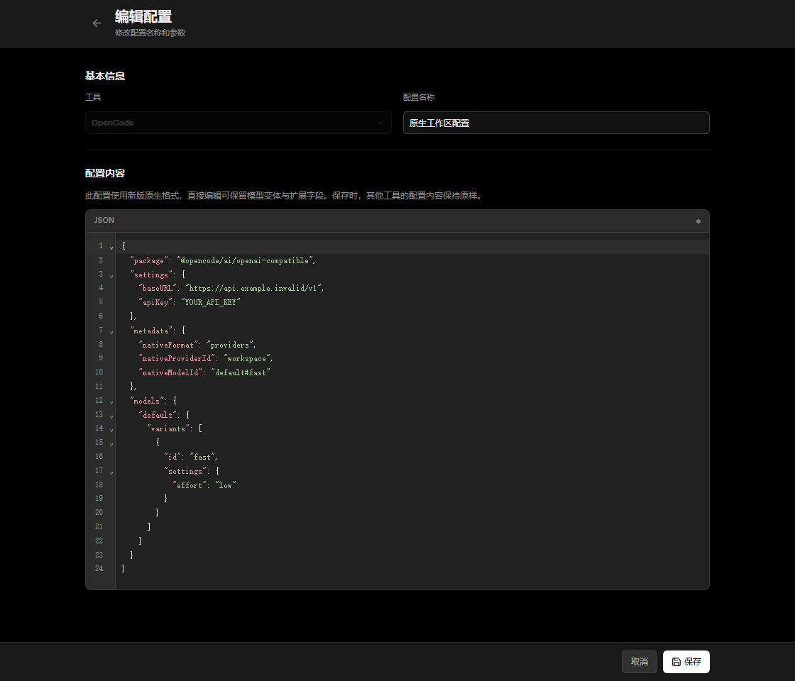

<div align="center">


# CCHub

### 一个桌面应用，切换 AI 编程工具配置

[](https://github.com/Moresyl/cchub/stargazers)
[](https://github.com/Moresyl/cchub/releases)
[](https://github.com/Moresyl/cchub/releases)
[](LICENSE)
[](https://tauri.app)

**Windows** · **macOS** · **Linux** &nbsp;|&nbsp; 中文 · [English](README.md)

[**立即下载**](https://github.com/Moresyl/cchub/releases/latest) &nbsp;&nbsp;·&nbsp;&nbsp; [反馈问题](https://github.com/Moresyl/cchub/issues) &nbsp;&nbsp;·&nbsp;&nbsp; [功能建议](https://github.com/Moresyl/cchub/issues)

</div>

---

## 用途

CCHub 以配置切换为主工作区。按工具筛选并搜索已保存的 Provider 配置，查看当前生效状态，一键应用；也可新建、编辑、复制、测速和检查流式连接。跨工具共享 Provider 和项目配置档案保留为按需展开或在设置中管理的高级选项。

Claude 配置切换会先检查两份配置文件。读取失败、格式损坏或存在重复字段时，需要先修复文件，不会把它们当成空配置覆盖。字段编辑保留未改动的文本和无关顶层设置，并保留现有状态栏、插件与 MCP 设置。成组保存会检测期间的外部修改，并在返回文件保存失败时恢复本次写入；其他程序的新修改会被保留。这项恢复不属于跨进程、断电事务。

Codex 和 Grok Build 的 MCP 编辑只更新连接字段，保留超时、OAuth、禁用状态等其他服务选项，以及未改动的注释和值；支持行内表和带引号的服务名。文件损坏或无法读取时停止编辑。原生 TOML 不写入共享模型中的 `type` 字段，编辑已有条目时也会清除它。Codex 在 stdio 与 HTTP 之间切换时清理不适用的工作目录、环境变量或 HTTP 认证字段，保留兼容选项和 HTTP 的本地执行位置；只填写 URL 的定义按 HTTP 写入。保存前检查期间的文件修改；删除不存在的条目不会新建配置文件。

配置档案读取、切换和工具初始化尊重自定义配置文件名，并按配置目录保存认证与环境变量文件。Claude 主 MCP 文件与 settings.json、MiniMax 的 mcp.json 与 config.yaml 分别解析。配置文件页显示自定义目录和目录外的单独 MCP 文件；单文件入口只授权该文件。相关路径读取遇到数据库或类型错误时停止操作，初始化先解析全部路径再创建文件。MCP 主工作区按服务来源识别配置，扫描、同步和删除使用相同的配置路径。

按应用读取 MCP 的接口直接读取该工具配置的原生文件，保留禁用条目、URL、认证与扩展选项，不会用其他工具的同名服务替代。JSON/JSONC、TOML 和 Hermes YAML 会检查容器和连接字段；损坏文件或错误路径返回错误，缺失文件返回空集合且不创建目录。不能无损表示为 JSON 的原生扩展值会明确拒绝导出。

JSON 格式的 MCP 连接编辑保留已有禁用状态、原生选项，以及未修改部分的注释和格式。MiniMax MCP 读取与编辑共用 JSON/JSONC 解析器，支持 BOM 并拒绝重复键。连接字段无效时停止写入，删除不存在的条目不会创建文件或目录。JSON 写入计划可合并同一文档中的多个条目，并参与统一服务目录的成组保存和回滚。

Hermes 原生 MCP 适配层修改连接时保留 YAML 头尾与未修改部分的注释、BOM、CRLF，以及已有禁用状态、超时、认证、工具权限和扩展选项，不再强制设置超时。SSE 使用原生 `transport: sse`；切换 HTTP 或 stdio 时清除旧连接字段。适配层读写和删除使用同一个自定义 MCP 文件路径。按应用读取接口会检查连接标记；保存会拒绝无效文档、无效连接参数，以及会改变其他设置的锚点修改。YAML 写入计划已接入服务目录扫描、明确的同步归属、成组校验和返回失败时恢复；这不是跨进程事务。

Hermes 配置档案切换复用同一个 YAML 编辑器，只更新模型的供应商、端点和默认模型，保留原有模型选项、MCP 设置及未修改的注释和原生扩展值。配置没有变化时不重写 YAML，也不为它额外生成备份；环境变量没有变化时保留 `.env` 原始字节。空档案不创建缺失文件或目录。配置、环境变量和本次新增备份一起参与保存校验与返回失败时的恢复。配置文件页的 Hermes 面板使用统一控件和可折叠的 JSON 高亮预览，预览遮盖密钥；读取失败时阻止编辑和保存，保存失败保留草稿。清空密钥或改名时明确删除原变量，变量名无效时提示修正。

应用单个工具配置或项目档案时，会先准备全部目标文件，再一起保存工具选择、工作区、档案时间和切换记录；开启 Claude 扩展集成时，其配置也参与本次保存。文件或数据库提交失败会恢复本次仍持有的文件修改，恢复不完整时保留原始副本并返回路径。项目档案保存的是工作区与工具配置选择；未涉及的工具选择保持不变，MCP、Prompt 和 Skill 的整组选择仍在完善中。本地快照刷新失败会保留上次成功的快照。档案面板和顶部选择器共享操作锁，保留失败草稿，并区分操作失败与操作成功后列表刷新失败。

完整备份恢复会先准备工具快照并暂存目标文件的原始内容，再写入工具配置、技能和附属文件。完整文件记录按备份顺序覆盖对应快照，保留二进制内容和换行格式。同一文件的不同路径写法共享一份恢复记录。安装数据库或提交项目路径迁移前，会再次核对本次写入；失败时只恢复仍属于本次操作的内容，保留较新的外部编辑、删除和路径变化。恢复不完整时，原始副本与恢复映射会保留在错误提示中的目录。这项恢复不属于跨进程、断电事务。

账户并发与请求优化开关独立。同一服务的相同 API Key、或同一托管登录账户跨配置和工具共享名额。可设置默认上限、账户单独上限、队列容量和 1–600 秒等待时限；并发为 0 表示不限制账户并发，队列为 0 表示不排队。等待按先后顺序放行，取消后释放等待项；流式响应完成或取消后释放名额。排队满额或超时返回本地 503，不发送上游请求、不惩罚供应商熔断状态。排队结束后重新核对托管账户，并重新取得原账户的令牌。状态区区分当前生效上限和待保存草稿，最多保留 256 个最近一小时使用过的身份，短请求完成后仍可单独设置。进程保护上限为 1,024 个活动队列、8,192 个运行请求、4,096 个等待项，以及合计 256 MiB 的原始及预处理请求体排队预留量。并发身份与本地状态命令不保留或显示原始凭据。

界面采用紧凑的明暗中性主题，使用统一的无边框桌面顶栏、原生窗口操作、折叠侧栏与 `Ctrl+K` 快速应用配置。新配置仅提供官方默认值或空白自定义模板，已有配置档案继续兼容。配置文件、MCP 服务和 Skills 位于辅助导航中。侧栏的“运行”视图提供代理管理、用量分析和会话浏览；Autopilot、Marketplace、安全审计等独立页面不再作为当前产品入口。升级不会删除已有配置数据。

---

MCP 同名服务按各自来源独立识别，编辑和删除使用选中的来源及打开表单时的版本。同步状态区分原始配置、已关联副本、独立配置、缺失和冲突；读取失败时保持未知状态。安装向导在进入下一步前显示校验说明，安装失败保留草稿。

恢复备份时，本机 MCP 配置归属、客户端授权和历史记录一起保留。未匹配本机身份的原生定义存入备份库，保留原生扩展类型及对应历史，不继承文件操作归属。在服务详情的“恢复”中可将条目恢复到原工具；已有同名配置不会被覆盖，数据库提交失败会回滚新增配置。能无损表示为 JSON 的定义也可复制；删除备份库条目不会删除原生配置文件。

备份库的同名保护针对单个服务条目恢复。完整备份中包含的工具配置和附属文件仍按完整恢复流程还原；它不是“保留所有本机文件不变”的合并操作。恢复后刷新服务列表，以查看实际文件状态。

## 工作台预览

| 深色主题                                        | 浅色主题                                         |
| ----------------------------------------------- | ------------------------------------------------ |
|  |  |

截图来自桌面应用，示例端点已匿名化。

### MCP 备份库



此截图展示实际 MCP 页面，使用隔离的演示数据，不代表原生桌面验收。

### 配置编辑器


模型发现按所选 API 协议连接，保留供应商报告的上下文与输出上限、输入输出模态、原生端点和推理等级。模型列表随配置保存，连接信息改变后失效。切换 OpenCode 模型时分别保留各自的设置；可明确选择填入报告的上限与模态，清空上限则恢复工具默认值。模型发现的分页共享 15 秒总时限，最多 50 页、10,000 条模型记录和 8 MiB 响应。

CLI 与托管账户的模型发现保留报告的上下文／输出上限、输入模态、推理等级与默认值。重复记录合并补全，隐藏项不进入选择器，也不改写已有模型 ID。缺失或损坏的能力保持未知，默认等级只提示，不自动写入配置。错误的目录结构会明确报错。CLI 目录查询限制为 2 MiB 和 15 秒，错误提示不显示上游正文或敏感网络详情；发现模型不等于验证推理权限。


此截图展示实际模型编辑组件，使用隔离的演示数据，不代表原生桌面验收。

本机 CLI 配额卡片独立更新 Codex 用量、Claude 用量与模型目录。刷新失败保留并标明上次结果，各项提供单独的失败提示，不显示凭据或错误正文。加载与认证状态明确可见，刷新按钮使用统一控件，用量条提供无障碍标签。


此截图展示实际配额组件，使用隔离的演示数据，不代表真实订阅查询或原生桌面验收。

托管登录账户的配额刷新失败时，卡片保留同一登录账户的上次成功结果，明确标记更新失败并支持单独重试。卡片显示上次成功读取时间与有效的重置时间；切换账户或重新登录后清除旧结果，避免混用。这里的上次结果仅保存在当前界面，不作为自动切换账户的依据。


此截图展示实际账户配额组件，使用隔离演示数据，不代表真实订阅查询。版本改动见 [版本记录](CHANGELOG.md)。

---

## 核心功能

| 功能              | 说明                                                           |
| ----------------- | -------------------------------------------------------------- |
| **配置切换**      | 保存并一键应用 Claude Code、Codex、Gemini 等工具的配置档案     |
| **Provider 管理** | 工具筛选、搜索、预设、连接测速、流式检查及跨工具共享配置       |
| **配置文件**      | 查看和编辑受管理工具的配置文件                                 |
| **MCP 服务**      | 扫描、编辑与同步各工具的 MCP 配置                              |
| **技能与插件**    | 浏览、编辑与跨工具同步 Skills                                  |
| **快速切换**      | `Ctrl+K` 搜索并应用配置，或跳转到保留的配置管理页面            |
| **原生配置**      | OpenCode 配置切换保留 JSONC 注释、MCP、插件及其他供应商设置    |
| **会话与用量**    | 浏览原生会话，导入普通响应、推理与缓存用量，重复同步不重复计费 |

### 会话与删除恢复

Codex 会话支持普通 `.jsonl` 和压缩 `.jsonl.zst` 日志的浏览、详情读取与用量导入。两种文件同时存在时优先读取普通日志，压缩后保持会话选择和记录标识；重复同步不会因文件格式变化重复计费。损坏或超过读取限制的压缩文件会报错，导入不会保留该文件的部分结果。

删除 Codex 会话前会保存原始副本，覆盖所选日志及其普通／压缩配对文件，可从“最近删除”恢复。最近一分钟更新过的文件会拒绝删除；恢复检查文件身份与内容摘要，目标位置已有不同内容时保留现有文件。外部共享索引和数据库保持原样；恢复范围不包含其他同会话分段或子会话。其他 App 的删除无法从这里恢复。批量删除逐项报告结果，成功项移除，失败项保留原因并可单独重试。

“最近删除”支持单条彻底删除和清空，操作前通过应用内弹窗显示会话名称并确认。清空仅作用于确认时列表中的条目及其版本，随后新增的记录会保留。每次移除文件前检查恢复记录与文件元数据，拒绝符号链接、嵌套目录和未知文件；部分失败时显示原因，刷新并重新确认后可重试。清理只移除恢复副本，不修改当前会话日志或共享索引。彻底删除不可撤销，失败时可能已经移除部分文件，不属于文件系统事务；不会自动到期清理。取消确认后焦点回到原操作按钮，错误提示隐藏底层细节，开启系统“减少动态效果”后关闭界面动画。

会话列表、详情读取和删除恢复通过后台文件任务执行，文件处理期间释放配置数据库。读取限制并发数量；删除、恢复、回收站清理及恢复列表共用一个队列。取消等待不会提前释放仍在运行的文件任务的互斥状态。

集成设置中的 Codex 历史迁移先预览来源、目标、普通／压缩文件和状态记录数量，再确认执行。默认来源取自当前 Codex 配置声明的旧分桶；执行核对预览版本，历史发生变化后需要重新检查。最近一分钟仍在更新的日志会停止迁移。迁移与会话删除恢复共用后台队列，不长时间占用配置数据库。

写入前保留原始日志、包含 WAL 数据的状态数据库快照及迁移账本。失败时回滚本次仍拥有的修改，保留外部的新编辑；未完成回滚时提示原始副本路径。这不属于进程崩溃或断电事务，也不代表完整备份恢复流程已经覆盖所有客户端数据。


此截图展示实际页面组件，使用隔离的演示数据，不代表原生桌面验收结果。

### 用量分析

模型价格设置共用一份草稿和保存入口，刷新状态与切换页面保留未保存选择；“保存并同步”先保存相同选项，再请求价格。常用模型标记由后端提供，与实际同步的有限集合一致；目录支持搜索、供应商筛选和完整分页。失败时保留选择并提示重试，不显示内部错误。设置冲突需要核对，或明确放弃草稿后重新加载；保存不覆盖较新的同步时间与错误状态。



此截图展示实际价格组件，使用隔离演示数据，不代表原生桌面操作验收。

按时间、应用、供应商和模型筛选用量，加载时仍可操作筛选栏；旧筛选的迟到结果不会覆盖当前数据。实时请求事件合并刷新，刷新失败保留同一筛选下的上次成功结果并提示重试。排名支持分页，长名称自动换行，窄区域改用卡片完整展示各项指标。无请求的日期不再显示非零趋势条。



这张截图来自实际页面组件，使用隔离的演示数据，不代表原生桌面验收结果。

### Prompt 指令库

指令、记忆记录与发布说明共用 Markdown 正文层次，统一标题、列表、引用、代码与表格。只读任务列表使用统一勾选框；表格提供可通过键盘聚焦的横向滚动区域。说明输入在保存前检查 2000 字符上限，并支持补充 Unicode 字符。文件冲突与读取失败提供本地化恢复提示，不显示原始内部错误。



这张截图来自实际页面，使用隔离的演示数据，不代表原生桌面操作验收。

按工具管理 Claude、Codex、Gemini、OpenCode、OpenClaw、Hermes 和 Pi 的指令版本，支持 Markdown 编辑、预览与搜索。导入保留文件原始内容；替换当前指令前，会将旧内容保留为另一条库内记录。删除库内记录不删除工具的当前文件。页面明确提示文件读取错误及内容差异，不把读取失败当作空文件，也不将内容不同的版本标为当前启用。

保存核对读取时的指令库与文件版本；冲突保留草稿，重新加载后可查看当前文件和库内版本再保存。写入期间阻止重复操作，迟到响应不会替换其他工具的状态。数据库提交报错时，回滚仍由本次保存持有的文件修改，并保留更新的外部编辑。这一恢复机制不覆盖进程崩溃或断电。

### 本地代理与故障切换

Chat 转发默认保留历史推理。在 `api.mistral.ai` 端点，可识别的助手纯文本推理会转换成原生 thinking 内容块，保留工具调用和已有内容块；加密、签名及未知推理详情不自动转换。其他端点仅在 HTTP 400/422 的结构化 `extra_forbidden` 错误明确指出已有助手推理字段时重试，无关错误保留状态、响应头与正文。每个端点最多修复三次，共用原始超时；故障切换从原始已准备的历史重新处理。

验证成功的历史兼容规则在有容量上限的内存中保留十分钟，按工具、配置、配置版本、实际端点、模型与托管账号登录版本隔离。只有正常完成的 Chat JSON 回复或流式回复才记忆新规则，修复失败或流中断不记忆。工具调用关联、未修改历史的字节和不透明数字的原始写法会保留。这不保证加密历史可以跨供应商重放。

Codex 文件编辑器将仅修改 API Key 计入未保存状态。保存使用原始 TOML 草稿，并对认证文件按字段更新；写入前核对两个文件读取时的版本。认证文件损坏或 TOML 无效会阻止整组保存。写入报错时只回滚本次仍拥有的修改，保留外部的新编辑；回滚未完成时保留原始文件并提示恢复路径。这不属于断电事务。晚到的文件读取和保存结果不会替换另一个文件或较新的草稿。编辑操作与文件导航使用统一控件。

Claude 本地选项开关保留 JSONC 注释、格式和无关设置。空文件、语法损坏、重复键、非对象配置或错误类型的 `env` 会提示错误并停止编辑。关闭尚未设置的选项不写入文件，也不会创建原本不存在的文件。

原生 Responses 与压缩请求转发会修复旧工具搜索项目 ID 的错误前缀。修复保留 `call_id` 关联、加密推理及其他历史字节，已有合法 ID 不变，改名避免与历史 ID 冲突。这不意味着加密历史可以跨供应商重放。

工具轮次路由识别 Responses 原生的函数、自定义工具和客户端工具搜索结果，通过有效的 `call_id` 延续当前轮次，也支持只携带结果的部分历史。没有调用 ID 的函数或自定义工具独立通知开始新轮次；托管搜索的无 ID 历史保持为内部历史。这项轮次识别只影响路由选择，不改写原生输入。

配置编辑器支持供应商独立的模型别名，仅通过本地代理转发时生效。完整请求模型名优先于 `*` 通用规则；供应商名称中的每个 `*` 都替换为当前请求模型，例如 `vendor/*`。别名在请求覆盖和全局模型映射之后应用，各个故障切换候选使用自己的规则。模型目录、路由匹配和会话身份不因别名改变。统计保留请求模型、实际转发名与供应商回复模型；回复确认使用该别名时按请求模型定价与聚合，回复另一个模型时按实际模型定价与聚合。历史记录保留当时的转发名，后续更改别名不会改变历史模型分类。编辑器提供成对填写、转发预览、重复与长度校验，并保留损坏的导入数据，直到明确修复或清空。最多 128 条规则，名称及展开结果最多 1024 UTF-8 字节。

在代理高级设置中，可分别管理 Claude、Codex、Gemini、Grok Build、OpenCode、OpenClaw 和 Hermes 的路由策略。分组支持按顺序尝试、每次请求轮流优先，以及固定选择一个配置；嵌套分组保留自己的策略，重复配置会去重，循环引用和超过八层的嵌套会被拒绝。路由保留当前已激活的配置。规则从上到下匹配，模型、图片、推理和最小请求字节数等已选条件必须同时满足；未匹配时使用默认分组或原有配置顺序。

草稿支持本地预览和模拟请求大小，不发送模型请求、不保存修改、不推进轮询。保存会核对读取时的设置版本；冲突时保留草稿，不会自动覆盖。实际路由限制在选中的分组内，并遵守重试预算与熔断状态；选中成员已删除时会提示错误，不会悄悄转向组外配置。

会话路由默认关闭，可选择自动、整个会话或当前工具轮次。仅使用客户端明确提供的会话标识，不根据相同提示词合并会话；工具、凭据、模型、推理设置及路由策略分别隔离。自动模式在工具调用延续期间保留配置，或在上次成功响应报告至少 1024 个缓存读取 token 后保留五分钟；整个会话模式最多保留 24 小时。只有成功响应会更新关联，流式响应须实际读到结束事件。固定的托管账号不会随默认账号切换，登录失效、配置变化和熔断仍按原有规则处理。关联仅存于有容量上限的内存中，不修改配置文件，不保证跨供应商的加密推理历史可重放。

高级路由新增“跳过额度已耗尽的账号”，默认关闭。先在账号设置查询用量：同一次登录、五分钟内的有效查询可用于跳过已确认耗尽的 Codex 或 Copilot 额度。Copilot 的高级请求额度仅影响账号模型目录中明确报告高级计费、且倍率大于零的模型，免费及未知模型仍可尝试；不限量、允许超额使用或仍有可用积分时不会误跳过。未知、过期或失败的查询不阻止请求。筛选依据别名等处理后的实际模型名，遵守所选分组与固定配置，不消耗请求失败重试次数，也不修改当前配置。全部选定候选均确认耗尽时返回带有限等待时间的 HTTP 429，不伪造用量或熔断失败。规则预览只展示候选顺序，不触发额度查询；其他供应商保持现有路由行为。

备用端点按顺序尝试，每个配置在候选端点全部失败后才累计一次失败。关闭跨配置故障切换或用尽重试预算时，会保留上游的 HTTP 状态、错误内容和 `Retry-After`。熔断冷却期间不会强行重试；全部候选被阻止时返回带等待时间的 HTTP 503。

恢复探测一次只允许一个请求，取消请求会释放名额。成功响应体完成读取后才计为健康；流式响应还会检查上游错误事件和结束标记，并正确处理拆包的中文、emoji 和 CRLF 换行。客户端读到完整结束事件后关闭响应，仍会记录成功和释放恢复名额；转换后的结束事件尚未被读取时取消，仍记为取消，不会因上游已经结束而误算成功。Chat、Responses 与 Gemini 转换会传递错误，异常结束不会被补成正常完成。手动重置或新一轮熔断后，旧请求的迟到结果不会改写新的熔断状态。

Messages、Responses、Chat 与 Gemini 直通流提前结束或读取中断时，会返回对应协议的错误事件；直通错误提示包含配置名称，不展示底层请求的 URL 或凭据。大事件的结束名称单独检查，正文超过 1 MiB 不会关闭结束检查；完整结束事件后断开连接也不会被误记为失败。Gemini 分段输入、输出、推理与缓存读数按累计值合并，中断时保留已上报的用量，重复片段不会重复累计。

Chat、Responses 和 Gemini 的流式协议转换逐事件解析，规范化换行后的单个 SSE 事件（含分隔符）上限为 8 MiB；同一响应最多分配 4096 个内容块，Chat 尚未取得工具标识的参数合计最多暂存 8 MiB。Chat／Responses 保留的工具标识和名称上限为 1024 字节。超限、非法 UTF-8 或未结束事件返回不含原始内容的 API 错误，并记为失败；不会补出正常完成。拆包的中文、emoji、CRLF 和多行 `data` 会正确合并。Chat 明确报告 `finish_reason` 后可以正常结束，无须额外的 `[DONE]`；未报告完成的 Gemini 响应按中断处理。

Chat 工具片段可重复同一 ID／名称，或省略它们以接续同一索引的调用。已确定的身份发生变化，或另一索引重复使用该 ID 时，转换会以不含原始内容的错误中断，不输出冲突参数，并保留已收到的用量、记为失败请求。匿名调用生成的 ID 会避开显式 ID，防止冲突。

流式用量在协议转换前采集，转换器未输出的用量事件仍会保留到请求统计；取消或中断也不会丢失已经读取的原始计数和模型名称。Gemini 的正文与推理计数分别到达时会合并为输出总量，后续缺失或较小的读数不会覆盖已有值。只有总量、尚未取得输入计数时，不会推算输出。

新增代理记录的输入用量统一包含普通输入、缓存读取和缓存写入。费用按实际上游协议分类计算：Messages 的普通输入不再重复扣除缓存，Chat／Responses 的输入总量则先扣除缓存读写，各分类分别使用已配置的价格。兼容嵌套的缓存写入字段，保留 Chat 最后单独上报的用量片段及 Responses 分段读数；转换后的 Messages 响应只将普通输入放入 `input_tokens`。统计页按每条记录的口径汇总总 Tokens，不重复添加新记录中的缓存。历史记录与原生会话导入保留原有统计口径，升级不会重算历史费用。

用量统计按请求的最终结果更新。同一请求的故障切换不会重复增加请求数；流式错误和中断会记为失败，取消会记为 499，并保留取消前已经上报的用量。请求明细与每日汇总同时保存，统计写入失败时不会留下不一致的部分结果。

流式连接中断与超时会返回带明确连接故障标识的协议错误，便于客户端判断后续操作。非法数据和读取上限错误保留各自的原因，不伪装为连接中断。已经输出的部分答案不会由代理自动转向备用配置重放；错误提示不回显上游地址或凭据。

在代理高级设置中可配置请求超时。普通响应每次尝试从发送请求到收完响应体共用一个总时限，默认 600 秒；流式响应从发送到首个上游字节默认 60 秒，等待下一块上游数据默认 120 秒，心跳也会保持连接。端点挂起时可在向客户端提交响应头之前切换到备用端点。设为 `0` 表示禁用，上限为 86400 秒。这些时限不包含获取凭据和读取客户端请求体的时间。

### OpenClaw 配置工作区

环境变量、工具和 Agent 配置在独立标签页中编辑，切换标签和检查状态会保留草稿。读取失败时提供重试并禁止保存空的默认值；保存失败后可以直接重试。环境变量中的结构化设置保持原有类型，工具和模型的扩展字段也会保留。支持编辑模型别名、撤销当前修改及键盘切换标签。



截图来自实际页面组件，使用隔离的演示数据；不代表原生桌面验收结果。

配置文件页直接打开设置中指定的 OpenClaw 原生文件。供应商、模型、别名和主模型／回退模型字段与 JSON5 高亮编辑器共用草稿，切换编辑方式不会另行写入文件。字段编辑保留注释、未修改内容、凭据引用与扩展字段；搜索记忆不会重读或覆盖配置草稿。保存前核对原始文件内容，外部修改或删除时停止覆盖，并保留草稿供重新加载核对。此保护不等同于跨进程或断电事务。





这两张截图来自实际配置文件与记忆组件，使用隔离的演示数据，不代表真实用户文件或原生桌面操作验收。

### 原生配置与用量同步

OpenCode 使用已有的 `opencode.jsonc` 或 `opencode.json`。配置档案保存原生供应商 ID 和选中的模型，编辑时保留 SDK 扩展参数与其他模型；应用时仅更新对应供应商和默认模型。检测到无效格式、重复字段或写入前的外部修改时，会停止更新并提示处理。

同时兼容旧版 `provider` 片段与新版 `providers` 配置，保留数组形式的模型变体、对象形式的模型选择与扩展字段。原生配置直接在语法高亮编辑器中保存，编辑共享配置时保留其他工具的配置内容。连接检查、用量凭据和本地代理转发按选中模型与变体解析覆盖参数；代理接管会清除模型层级的地址与认证覆盖，避免绕过本地端点。



截图来自实际配置页面，使用隔离的演示数据与占位密钥；仅作为渲染界面证据，不代表原生桌面验收。

在“运行 → 会话”中点击“同步用量”，可以导入 OpenCode V1/V2 数据库里的已完成请求。缓存读写和推理输出纳入统计，压缩请求的用量计入合计；未完成响应等待下次同步。后续用量修正会更新原记录，同一会话迁移或数据库移动后不会再次导入。清理明细日志后仍保留去重账本，SQL 备份也会携带账本。部分来源同步失败时，结果弹窗会列出具体错误。

### 供应商余额与额度

配置用量弹窗显示供应商返回的所有币种和额度窗口，零余额也会正常展示。未知单位与缺失的用量保持未知，只有余额时不会推算额度比例。内置余额与 Coding Plan 查询仅自动识别准确的官方 HTTPS 主机；明确选择 Coding Plan 供应商时使用该供应商的固定查询地址。通用中转查询的所有候选地址共用 20 秒时限，官方查询为 15 秒；JSON 响应上限为 2 MiB，凭据不会随重定向发送到其他站点。

网络失败后刷新会保留同一配置上次成功的数据，并明确标记刷新失败；鉴权失败会替换旧结果。切换配置、工具或配置内容后清除旧读数，迟到请求不会覆盖当前结果。展开的只读 JSON 视图支持代码高亮和长内容滚动。

### 协议回复兼容

跨协议 Claude 代理将 Chat Completions、Responses 和 Gemini 的普通与流式回复统一为 Anthropic 消息 ID，保留其工具调用 ID。缺少上游消息 ID 时生成独立随机 ID；Responses 流缺少或重复起始事件时仍只输出一次消息开始，完成后只输出一次结束。原生 Anthropic 回复的消息 ID 保持原值。

Gemini 工具结果按 ID 对应历史调用，并使用实际函数名，支持同一函数的并行调用和乱序返回。回复缺少调用 ID 时生成 UUID，工具失败保留错误结果。无法匹配或重复的历史 ID 在本地以 API 错误拒绝；回复中的重复 ID 会停止转换，不重复输出工具调用，也不补成正常结束。转换失败保留已上报的用量，仍计为失败请求。工具标识状态限制为 4096 次调用、每个 ID 最多 1024 字节；这些限制不涵盖整个解析器或推理签名历史。

Gemini 普通与流式回复使用相同的用量解析规则，缺少总 token 数时仍保留有效的输入、输出、推理和缓存计数。普通回复的输出用量包含已上报的推理 token；统计保留上游实际模型名，转换失败后切换备用端点不会重复计算请求。

Responses 转换支持标准推理摘要、推理文本事件及仅在数据中声明的事件类型。推理分段使用独立内容块，切换到文本或工具前关闭，完成快照不重复输出；缺少增量时可恢复最终分段。推理状态设有分段数量和标识长度上限；即使供应商完成回复，转换器错误仍计为失败请求。这些限制针对推理状态，不代表整个流解析器已具备内存上限。

普通工具转换到 Responses 时明确保留非严格模式，客户端明确指定的 `strict: true/false` 同时在 Responses 和 Chat Completions 转换中保留。转换不会为了严格模式把可选参数改成必填，托管网页搜索工具不添加函数专用的 `strict` 字段。原生协议请求的工具定义保持原样。

### OAuth 账号状态

Claude 代理使用 Codex OAuth、xAI OAuth 或 GitHub Copilot 时，每次请求携带实际选中的账号与登录版本；未绑定配置跟随默认账号，明确绑定的配置保持指定账号。Codex 请求的账号头也使用实际选中的账号。账号移除或重新登录后，旧请求不能更新端点偏好或发送配置故障转移通知；Grok Build 的 xAI OAuth 代理也使用同样的账号校验。

GitHub Copilot 的并发令牌刷新共用一次请求，旧刷新结果不能覆盖新登录或恢复已删除的账号。账号保存使用原子文件替换，保存失败时保留原来的账号、默认选择与缓存凭据。令牌响应限制为 2 MiB，空令牌、过期令牌与无效响应不会进入缓存，错误提示不展示令牌接口返回的正文。

Codex OAuth 与 xAI OAuth 的刷新凭据明确失效后，会在本机保留“需要重新登录”状态，普通网络错误与代理验证失败不会因此清除账号。重新登录或移除账号后，旧刷新请求不能覆盖新登录状态；取消设备码登录也会通知后端，取消后返回的授权结果不会重新写入账号。Codex 账号面板保留失效账号及重新登录入口，配额失败可重试，并按当前账号隔离迟到结果。

Codex OAuth 配额与模型查询、xAI OAuth 模型查询收到 HTTP 401 后，会为原账号刷新令牌并重试一次；再次被拒绝才将当前登录标记为需要重新登录。切换默认账号不会改变正在进行的查询归属，迟到的拒绝也不能清除已更新的缓存令牌。HTTP 403、限流和服务端或网络故障保持为查询错误。恢复流程总时限 45 秒，响应流限制为 2 MiB，重定向限定在初始站点内，错误提示不展示供应商返回的错误正文。本集成仍无法查询 xAI 配额，不推算额度。

Copilot 配额与模型支持逐个查询所有保存账号，无需编辑器另行登录。选择查询账号不会修改默认账号；配额和模型错误分别展示，模型明细可展开，并显示查询时间。缺失额度保持“未提供”，不限量额度单独标明，也支持小数剩余额度。两项查询绑定同一次登录修订号，共用 45 秒总时限，每项响应限制为 2 MiB。账号变更后丢弃旧结果；模型查询收到 HTTP 401 时重试一次，迟到拒绝不会清除更新后的缓存令牌或删除保存账号。选择器的长选项会在窗口可用宽度内换行。

账号模型明细可按名称、ID 或供应商搜索，并按计费类型筛选。供应商明确报告的零倍率显示“不消耗高级额度”，高级请求显示对应倍率；缺失或无效数据保持“计费信息未提供”。重复模型合并为一项，若均为高级计费但倍率不同，则保留高级类型并标明倍率未确定。展示与额度路由使用相同的账号计费解析规则。倍率表示高级请求额度消耗量，不是 token 单价，也不代表免除聊天额度或订阅限制。配置拉取的模型目录会保留这类计费元数据，模型选择器同时展示计费标签；较长名称和价格信息在窄窗口内换行。

### 余额与额度提醒

在配置的用量与余额窗口中开启提醒。默认关闭；软件运行期间约每 5 分钟检查一次，使用此配置的用量查询脚本或供应商接口。额度百分比与余额阈值分别设置，不同货币和积分按查询结果的单位匹配。查询账号变更后暂停监控，重新保存设置才会绑定当前配置；失败或过期读数不会触发提醒。

顶部通知中心保留最多 200 条本机历史，支持标为已读和立即检查。同一已知额度窗口只提醒一次；没有重置时间的额度与充值后的余额通过回差避免阈值附近反复提醒。可选系统通知在提交失败后最多重试 6 次。“已交给系统”表示系统接受了请求，不代表用户已经看到；若系统接受后、回执保存前发生中断，系统通知可能重复，应用内历史在提交前已经保存。云恢复保留本机提醒设置与历史。本机回环地址的用量查询直接连接，避免系统代理绕过规则干扰本地中转；远端地址保持原有代理行为。

### 云备份设置

WebDAV 密码与 S3 密钥保存在系统密钥环，并绑定到对应的服务器和账号。更换服务器或账号后需要填写对应凭据；原账号的凭据仍可在切回时使用。修改设置后先保存，再读取、上传或恢复远端备份。返回可见窗口时，仅在表单空闲且没有修改的情况下刷新已保存设置；后台刷新保留草稿，编辑或保存后忽略过期响应，关闭页面后停止更新。S3 签名区域变更会清除旧远端状态；使用自定义服务端地址时，账号和备份位置不变可沿用已保存的备份密码。从远端恢复前会提示确认覆盖本地数据库，确认期间锁定其他操作，取消后可以重试。

云恢复会保留本机云账号及备份密码设置、工具自定义目录、代理、窗口与终端偏好，以及已有工作区的本机目录。配置片段、公共配置、统一供应商、技能仓库和请求优化设置等共享配置库从备份恢复。其他设备的新工作区需要选择本机目录；项目文件先保留为待迁移快照，即使原路径在本机存在，也不会直接写入。完成时仅更新仍属于此次备份位置的同步状态，两个云存储的上传和恢复不会同时执行。本地 SQL 文件导入仍按完整备份恢复。

云恢复、本地 SQL 导入和托管备份恢复完成后，会清除旧配置查询缓存，并更新迁移总览、待迁移项目和本机路径。导入总览显示恢复数量与安全备份位置；有待迁移项目时自动展开路径映射。恢复后的页面刷新失败会单独提示，不会把已经完成的恢复误报为失败。

上传前必须设置并保存至少 12 个字符的“备份密码”，它与服务器登录密码分开保存，并绑定服务器、账号和备份位置。新备份使用 AES-256-GCM 加密，密码通过带随机盐的 PBKDF2-SHA256 派生密钥。其他设备恢复时必须填写同一备份密码，请自行保管；修改密码后仍需保留旧密码，才能恢复使用旧密码加密的备份。删除备份密码前需关闭自动上传。

下载过程限制清单为 64 KiB、备份内容为 15 MiB（加密文件额外允许 68 字节格式开销），超过限制会立即停止。恢复前检查快照路径、声明大小与 SHA-256，并完成解密认证；密码错误或加密内容被修改时不会导入。旧的未加密备份仍可恢复，但必须明确确认使用旧格式；旧 WebDAV 备份没有摘要时仍会检查实际大小。每次上传使用独立的快照文件名。

上传使用条件写入：快照只能创建，备份清单只能替换刚读到的强 ETag 版本。远端在检查或上传期间变化时立即停止，不会退回无条件覆盖。第一次连接已有备份或发现其他设备的新版本时，可以先恢复，也可以在手动上传时确认替换；确认只适用于当时看到的版本。自动上传不会替换本机尚未接受的版本，已删除的备份也需要手动确认重新创建。成功上传或恢复后，本机接受的版本保存在系统密钥环，不随数据库备份迁移。没有强 ETag 或不支持条件写入的存储仍可下载，上传会停止；旧快照文件不会因替换清单而删除。

备份导入会检查工具标识、相对路径和编码内容，拒绝越界路径、Windows 设备名、损坏内容以及目标根目录下的符号链接或目录联接。写入前暂存原文件；工具、附属文件或数据库更新失败时，会回滚此前修改的文件并保留原数据库。若文件占用等原因导致回滚失败，会保留原始文件暂存和恢复路径清单，并提示其位置。数据库恢复期间保留原连接，其他操作不会读到临时空数据库。项目路径迁移也会在失败时回滚路径记录与文件；进程中断后的自动恢复尚未实现。

SQL 备份先加载到临时数据库，只能使用应用已有的数据表和索引。访问外部数据库、修改数据库结构、创建触发器以及执行 SQL 函数等指令会被拒绝；超时或无效数据会撤销本次 SQL 导入，错误信息不会回显备份内容。

### 平台特性

| 功能              | 说明                                                         |
| ----------------- | ------------------------------------------------------------ |
| **跨平台**        | Windows 10/11、macOS 10.15+、Linux                           |
| **深色/浅色主题** | 紧凑桌面端界面，支持键盘焦点与减少动态效果                   |
| **备份恢复**      | 配置导出为 SQL，支持导入旧版格式                             |
| **自动更新**      | 优先使用签名 Tauri 更新包，并提供可靠的 GitHub Releases 回退 |
| **多语言**        | 中文、英文、日文                                             |
| **系统托盘**      | 关闭窗口最小化到托盘                                         |

---

## 下载安装

| 文件                                                                       | 平台    | 说明                                                |
| -------------------------------------------------------------------------- | ------- | --------------------------------------------------- |
| [`CCHub_x64-setup.exe`](https://github.com/Moresyl/cchub/releases/latest)  | Windows | **推荐** — 品牌化中英双语 NSIS 安装包，支持自动更新 |
| [`CCHub_x64_en-US.msi`](https://github.com/Moresyl/cchub/releases/latest)  | Windows | 品牌化 MSI 格式，适合企业部署                       |
| [`CCHub_aarch64.dmg`](https://github.com/Moresyl/cchub/releases/latest)    | macOS   | Apple Silicon (M1/M2/M3/M4)                         |
| [`CCHub_x64.dmg`](https://github.com/Moresyl/cchub/releases/latest)        | macOS   | Intel                                               |
| [`CCHub_amd64.deb`](https://github.com/Moresyl/cchub/releases/latest)      | Linux   | Debian / Ubuntu                                     |
| [`CCHub_amd64.AppImage`](https://github.com/Moresyl/cchub/releases/latest) | Linux   | 通用 AppImage                                       |
| [`CCHub_x86_64.rpm`](https://github.com/Moresyl/cchub/releases/latest)     | Linux   | Fedora / RHEL                                       |

---

## 技术栈

| 层       | 技术                                                                      |
| -------- | ------------------------------------------------------------------------- |
| 桌面框架 | [**Tauri 2.0**](https://tauri.app) — Rust 后端 + Web 前端，安装包仅 ~20MB |
| 前端     | **React 19** + **TypeScript** + **Tailwind CSS 4**                        |
| 后端     | **Rust** — 高性能、内存安全、单文件分发                                   |
| 数据库   | **SQLite**（rusqlite）— 零依赖本地存储                                    |
| 构建     | **Vite 6** + **pnpm**                                                     |
| 数据层   | **TanStack React Query** — 统一缓存与状态管理                             |
| UI 组件  | CCHub 设计系统 + **Tailwind CSS 4** + **cmdk** + **Lucide**               |

---

## 开发指南

### 环境要求

- [Node.js](https://nodejs.org) >= 20
- [pnpm](https://pnpm.io) 10.32.1
- [Rust](https://rustup.rs) stable
- [Tauri 2.0 前置依赖](https://v2.tauri.app/start/prerequisites/)

### 快速开始

```bash
git clone https://github.com/Moresyl/cchub.git
cd cchub
pnpm install
pnpm tauri dev
```

### 构建

```bash
pnpm tauri build
```

Windows 安装器视觉资产、双语文案与校验方式见 [docs/WINDOWS_INSTALLER.md](docs/WINDOWS_INSTALLER.md)。

---

## 扫描路径

CCHub 自动扫描以下配置源：

| 路径                                           | 来源                                              |
| ---------------------------------------------- | ------------------------------------------------- |
| `~/.claude/plugins/**/.mcp.json`               | Claude Code 插件（递归）                          |
| `%APPDATA%/Claude/claude_desktop_config.json`  | Claude Desktop                                    |
| `~/.cursor/mcp.json`                           | Cursor                                            |
| `~/.codex/config.toml`                         | Codex CLI                                         |
| `~/.gemini/settings.json`                      | Gemini CLI                                        |
| `~/.hermes/cli-config.yaml` + `~/.hermes/.env` | Hermes Agent (NousResearch)，YAML + dotenv 双文件 |

---

## 参与贡献

欢迎提交 PR！查看 [Issues](https://github.com/Moresyl/cchub/issues) 获取灵感。

```
Fork → 创建分支 → 提交更改 → 推送 → 发起 PR
```

---

## Star 趋势

<div align="center">

如果 CCHub 帮你省了时间，给个 Star 支持一下，让更多人发现这个项目。

[](https://star-history.com/#Moresyl/cchub&Date)

</div>

---

## 许可证

MIT License — 详见 [LICENSE](LICENSE)。

## 致谢

- [Tauri](https://tauri.app) — 轻量级桌面应用框架
- [Claude Code](https://docs.anthropic.com/en/docs/claude-code) — AI 编程助手
- [MCP](https://modelcontextprotocol.io) — 模型上下文协议
